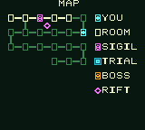
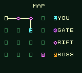
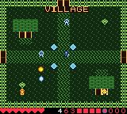
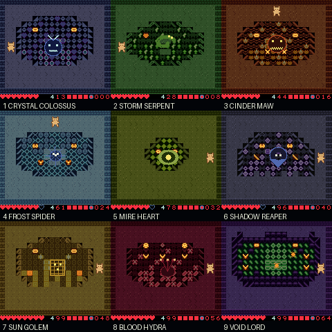

# Quintra

**A procedural Zelda-like action roguelike for the Game Boy Color.**

Native CGB. Five monster-human classes, procgen dungeons every run, bullet-hell
bosses, and item-driven builds. Heavy [Penta Dragon](https://en.wikipedia.org/wiki/Penta_Dragon)
influence (dense projectile patterns) crossed with the maze-exploration feel of
Zelda: Link's Awakening / Final Fantasy Adventure / Ultima: Runes of Virtue.

Written in C with GBDK-2020 — the only thing that ships on cart. All content
authoring and dev tooling is a typed **Rust** workspace that generates the C
tables at build time.

[Download the latest ROM — v0.18.70: Riftwild Deepens](https://github.com/struktured-labs/quintra/releases/latest)


The current reel shows the animated five-spirit prologue, champion selection,
live dungeon combat, the Riftwild overworld, a nonlinear cave-to-vault
teleport, and the animated epilogue. The transitions shown are executed by
the cartridge runtime.

### Current release

The current cartridge is **v0.18.70**, published after the complete build,
media, cartridge, checkpoint, gameplay, and controller verification gate.

**Riftwild is now a two-axis scrolling field rather than sixteen fixed
boxes.** Every one of its 4×4 logical cells is a 224×200 world behind the
160×136 LCD viewport. Walking through either former screen edge now pans into
another 64px of generated terrain; only the true x=216 or y=184 threshold
advances to a neighbouring cell. East and south arrivals begin at the
matching far camera bound with the champion visible. Together, the authored
graph spans 896×800 traversable logical pixels before its nonlinear Rift
Wells, up from the original 640×544, while retaining learnable 4×4 geography
and seed-rotated fixtures.

The added field is first-class gameplay terrain. Its tiles live in WRAM and
are shared by rendering, player and projectile collision, enemy movement, the
input-only controller, camera tests, and generated checkpoints. Each cell has
three seed-stable landmark clusters across its original, eastern, and southern
terrain, plus encounter pressure in the southeast beyond both old seams. The
obsolete edges are grass or path, the actual far boundaries follow the
overworld graph, and outdoor transitions use a safe full rebuild because the
wide source already occupies 28 of the Game Boy background's 32 columns.

This is a material reduction in screen-change cadence, not the final
continuous-overworld architecture. Logical-cell boundaries still load
generated cells; the longer-term target remains broader uninterrupted regions
and larger dungeon wings. The 224×200 slice deliberately reuses the proven
Crystal world/camera contract so scale grows without splitting collision,
art, controller, and cartridge behavior into competing implementations.

**Quintra now has a world that is genuinely wider than the Game Boy
screen.** The opening Crystal Colossus occupies a 224×136 arena—28 background
columns behind a 20-column viewport—with a real 0–64px tracking camera. The
champion, boss, bullets, melee arcs, drops, collision, and controller pilot all
share world coordinates. Crossing x=160 reveals a second crystal mass and
warp well rather than another room load. Crystal announces and jumps among
three wells at x=24/96/176, and its east exit exists only at the true far wall
after the kill. Every ordinary room and the other eight Colossi still reset to
the proven 160px contract. This is the reusable engine slice for larger
Riftwild fields and less compact stages, not a decorative camera sway.

**SELECT now opens an actual compressed pocket grid.** The dungeon occupies
the left side as a complete faint 6×5 lattice: one 8×8 square per room and one
8×8 segment per real corridor. Visited rooms and traversed links brighten as
the run progresses, while cyan, violet, and amber marks identify the current
room, Sigil, trial, and warned Colossus threshold. A permanent right-hand key
labels `YOU / ROOM / SIGIL / TRIAL / BOSS / RIFT`, so the screen no longer
depends on README knowledge or asks one oversized square to explain itself.
Only the active 20–30-room footprint appears; the map shows geography without
inventing inactive cells.

**Dungeons now contain a real macro-scale junction instead of only a long
corridor.** Local room one branches east around the Sigil/Warden/Waystone
objective wing and south into the deeper expedition. The two paths rejoin at
room ten, forming one large, memorable loop on the actual 6×5 playfield.
Following the staged objectives takes 19–29 room-to-room moves across the
campaign, while a player who experiments with the deep branch can recognize
the missed wing on SELECT and route back deliberately. Seeded room geometry,
encounters, puzzles, rewards, and nonlinear Rift Wells remain roguelike; the
large loop is a learnable geographic fixture rather than another random
shortcut.

**One-tile scenery is solid across the champion's complete width.** A 12px
collision footprint can cover three 8px tiles, so the former two-corner test
could miss a pillar directly under the hero's centre. That explained both the
reported bottom-edge clipping and a deterministic top-wall pocket in the
nine-stage controller run. Normal movement and dashes now sample left, centre,
and right; a live-ROM regression attacks the exact centre-line gap. A hero
knocked partly into scenery can still move out until the exceptional overlap
clears, preventing collision correctness from becoming a new soft-lock.

**The Compass exposes the junction in the same visual language used in play.**
At room one, the bright route splits east toward the objective wing and south
toward the deep route inside the faint complete grid. Both connecting lines
come from the same reciprocal graph that owns the cartridge's physical doors.
This makes the squares read as rooms and exits rather than a decorated stage
counter, while the explored path still fills visibly over the expedition.

**Native mGBA training states now follow one continuous playthrough.**
`make timed-mgba-states` drives an Easy Picsean run with ordinary controller
input and saves real `.ss0` files at 5, 10, 15, 20, 25, and 30 emulated
minutes. Every state is hash-bound to its ROM and cold-loaded through mGBA
before publication. `make play-timed-mgba-state TIMED_CHECKPOINT=25` opens a
selected beat in the software-rendered mGBA-Qt wrapper. The final Void Lord's
World Collapse retains its full 11-HP positional punishment on Normal, but
obeys Easy's one-damage inspection contract so the test mode can actually
reach and study the ending.

**Raw room count is not the same thing as perceived scale.** Stage one owns
20 screens and 12 entrance-to-boss room visits; later stages grow to 30
screens and 22 direct room visits, or 29 required-objective transitions.
A measured Easy controller run can still reach stage three by minute five,
and ordinary dungeon rooms remain single 160×136 playfields beneath the HUD.
The result can therefore still feel compact despite the larger topology.
v0.18.68 delivered the first true scrolling Penta-style arena and the shared
world/camera path behind it. v0.18.69 applied horizontal travel across all
sixteen Riftwild cells; v0.18.70 expands every one to 224×200 with a real
two-axis camera. Larger uninterrupted regions and spatially meaningful dungeon
side wings remain the next scale work. Adding room counters alone is
explicitly not the answer.

**Dungeon room count now becomes real traversal distance.** The former graph
added a vertical shortcut between every adjacent row, collapsing nominal
20–30-room stages into only 7–16 entrance-to-boss rooms. Each dungeon now owns
one large objective loop and no cross-map Manhattan seams. Across the
campaign, the direct entrance-to-boss path spans 12–22 room visits, while the
required Sigil/Warden/Waystone expedition spans 19–29 transitions. Long snake
rows become recognizable wings instead of a compact rectangle, while retaining
the nonlinear room-2/room-8 Rift Well pair.

**The SELECT Compass reads as a room map on the native LCD.** Each dungeon
cell is one outlined tile in a compact 6×5 grid, with one-tile corridors
between actual neighbours. The current room is cyan; the Rift Sigil is violet;
the Colossus room and next required trial are amber. Every active cell begins
as a dim square and visited rooms and links brighten exactly as traversed. The
full 30-room Void maze fits beside the permanent six-symbol legend.

**Dungeons have both a larger room budget and longer critical paths.** The
campaign starts at 20 rooms and grows through 21, 22,
23, 24, 25, 26, 28, and 30 rooms, including each Colossus arena: **219 dungeon
screens** in a successful run.
Every dungeon inhabits a 6×5 footprint. A guaranteed winding spine makes the
whole route traversable, while the fixed room-1/room-10 junction makes the
first two rows a large objective loop instead of opening every row pair and
collapsing the maze into a short Manhattan walk. The SELECT Compass renders
the same actual edges in a compressed tile-native 6×5 graph, including the
full 30-room Void route. Nonlinear Rift Wells remain seed-driven
room-2/room-8 shortcuts.
v0.18.60/v0.18.61 suspend saves migrate their stage, town, world anchor,
sanctuary, or boss threshold into the larger campaign. Secret caches now
author an explicit return doorway, so a passage revealed through a closed maze
edge can never become a one-way trap.

**Deep checkpoints now open natively in mGBA-Qt.** The external curriculum
matches the existing PyBoy coverage: all five champions in Normal and Easy at
nine entries, nine sanctuaries, nine live Colossi, eight fresh Riftwild
arrivals, and two villages—370 ROM-bound `.ss0` files. Generation restores
every file inside mGBA and independently boots one state from each checkpoint
family through mGBA's `-t` path. A hash-pinned manifest prevents stale states
from opening against a rebuilt cartridge, and `make play-mgba-state` uses the
project's software-rendered GUI wrapper. These remain development fixtures;
the cartridge save system and battery SRAM are unchanged.

The v0.18.67 Compass supersedes v0.18.65's large frontier-only boxes. It shows
the complete active lattice in dim ink so the screen is immediately
recognizable as a map, while room identities, Sigils, Wardens, and boss
information remain hidden until those clues are earned.

**Dungeon depth comes from required fixtures, not padding.** Every stage
contains the second seeded puzzle and deep-Warden lesson; later routes add a
third miniboss at local room 15. Villages still break the route after dungeons
three and six. Rift Wells reserve a champion-width central cross to both
landings. Each stage's authored terrain identity returns in local room four as
a full-strength landmark—grove, gauntlet, vault, mire, keep, temple, blood
sigil, or void arc—so the expanded route does not read as generic padding.
Human testing correctly noted that raw room count still felt compact when a
short fully connected graph could bypass most authored beats. The route now unfolds as
a visible fixture chain: room two's **Rift Sigil**, room three's mechanical
**Warden Boon**, the room-seven **Waystone**, and the room-nine **Deep
Warden**. The Compass reveals one next trial at a time, and the sanctuary keeps
its return route open until every fixture is earned. Authored stage
architecture now repeats in local rooms 11 and 17, while rooms 5, 11, and 17
become lighter one/two-enemy turn courts that break the route into recognizable
wings. Body-wide side rails prevent layered random and authored geometry from
forming one-way underhang pockets. Pushable cairns also reject only those final
moves that would jam a cardinal threshold into an impassable eight-pixel slit.
This makes expeditions
traverse their back half instead of cutting diagonally across the old grid.
Normal keeps the full Warden HP and escort pressure; Easy halves required
Warden HP and uses one escort so deep-route testing remains practical.
Suspend saves from every earlier explicit topology migrate to the equivalent
stage, town, world anchor, sanctuary, or boss threshold.

**Dungeon locks are no longer synonymous with extermination.** Procedural
dungeons rotate three non-combat room families alongside the existing selective
arena seals. A normal-looking 16×16 cairn can be the keystone that releases a
room when pushed; three floor runes demand one seed-stable walking order, with
an ascending note and lit tile confirming every correct step and a visible
reset on mistakes; paired phase switches persist into the following room,
raising or lowering a colored wall there. Puzzle rooms remove mandatory
hostiles, always preserve the return threshold, and persist their solved state
through dungeon backtracking. A new low rumble and D–F–Ab–D discovery figure
lets the final solve linger instead of sounding like another coin pickup.
Room slides now advance both music and SFX on every transition VBlank, so the
sequencer continues its phrase rather than droning one stale note between
screens. The safe-spawn reachability flood is now a linear WRAM queue in the
generator bank instead of a repeated full-room scan with thousands of
cross-bank predicate calls. A measured same-stage doorway—including procgen,
fixtures, the 18-frame slide, palettes, HUD, and restored sprites—fell from
103 to 38 frames, and a live-ROM contract rejects regression above 45.

**Riftwild now has the same pocket-map grammar as the dungeons.** SELECT draws
its visited 4×4 topology as a compact one-glyph graph rather than sixteen
large terrain thumbnails. Cyan `YOU`, violet `RIFT`, a marked `GATE`, and
amber `BOSS` labels live beside the graph on the Game Boy screen. Sixteen dim
hollow slots establish the 4×4 grid immediately; exploration replaces them
with bright semantic nodes and reveals only the links actually travelled.
Vaults retain the familiar violet objective diamond.
This makes the next-dungeon route and nonlinear cave hops readable without a
README legend or sacrificing fog of war.

**Riftwild cells now have seed-stable geographic landmarks.** Every 4×4
crossing contains four meadow, pond, standing-stone, and old-stump clearings;
the run seed rotates which coordinates own each family. Backtracking therefore
returns to a recognizable place, while a new expedition remixes the geography.
All solid landmarks stay outside the two-tile trail cross, preserve every
authored exit, and leave Normal/Easy encounters, HP, and routes identical. A
live-ROM sweep crosses all sixteen cells, checks four instances of each family,
and emits a native-resolution visual atlas.

**Procgen variety is now a measured cartridge contract.** A 512-seed Rust
corpus produces 393 distinct gameplay silhouettes after decorative floor
textures are normalized, with optional crates, spikes, and pots; it also
covers secret cracks on all four walls, both dungeon-shop premium forks, and
all four nonlinear Rift Well anchors. A second test samples 108 rooms from the
linked ROM after stage architecture and entity spawning: every stage produces
12/12 distinct geometry and encounter signatures, exposes 5–7 enemy species,
and varies ordinary-room population from two to seven. These checks protect
meaningful cover, hazards, routes, rosters, and elite rolls—not merely palette
or pebble differences.

**Normal is the authored balance; Easy is a playtest assist.** On the champion
screen, press **SELECT** to switch `SELECT MODE NORMAL` to `SELECT MODE EASY` before choosing
with A. Normal keeps the intended enemy durability, projectile pressure, boss
patterns, and progression. Easy is intentionally generous for deep testing:
every champion starts with eight fully visible hearts, +4 ATK, +2 DEF, loses
at most half a heart per impact, receives four times Normal's post-hit repositioning
time, and suffers much slower attached-Leech drain.
It deliberately uses the same procedural worlds and room geometry; required
Wardens alone use half HP and one escort instead of Normal's two so the testing
route remains viable. Fine Easy-mode balancing is deferred while Normal remains the
design target. A live-ROM regression compares all 185 paired Normal/Easy
entry, sanctuary, boss, Riftwild, and village checkpoints and pins identical generated
tiles, route state, ordinary enemy placement/HP, and boss-pattern identity
underneath the assist modifiers.
Controller balance runs also default to Normal. Focused deep-fixture checks may
set `QUINTRA_BOT_EASY=1`; this presses SELECT through ordinary input and never
writes HP, progression, enemies, or RNG. It is for reaching the system under
test, not evidence that Easy or Normal is balanced. The end-to-end victory
replay deliberately uses this assist: it crosses the same seed, rooms,
rosters, Sigils, villages, Riftwild, and nine bosses, then reproduces the exact
buttons on a clean emulator. Normal remains the only balance acceptance mode.

**Normal elites now repay risk instead of becoming pure attrition.** Their
doubled HP, bonus damage, glow, spawn rate, and score are unchanged. Defeating
one while wounded drops a visible half-heart; defeating one at full health
keeps the established five-coin reward. This preserves hard-mode encounter
pressure while giving the player a small, positional recovery opportunity
after an unlucky early elite roll, borrowing Penta Dragon's plentiful pickup
economy rather than weakening the enemy roster.

**Spirit Convergence now teaches its own input.** The Pack's final line reads
`FULL MP A B CHORD`, using only glyphs the cartridge font actually renders.
At full MP the two HUD digits brighten from blue to icy white; spending B or
the chord returns them to blue. The cue exposes the shared 18-second ascended
form in play instead of leaving Quintra's defining Penta-style power spike in
the README. Its duration, damage, MP cost, procgen, and Normal/Easy balance are
unchanged.

**Riftwild and the village now identify themselves in the live playfield.**
Amber tile-native `RIFTWILD`, `VILLAGE`, `MARKET`, and `FORGE` landmarks sit
over the underlying walkable grass/path cells, so the outdoor connector and
three civic screens no longer rely on README knowledge or the Pack screen to
explain what they are. Their display overlay changes no collision, room graph,
procgen seed, encounter, or Normal/Easy balance. Live-ROM traversal tests pin
all four labels, the Riftwild's 4×4 route and cave vault, and the village's
three connected screens and northward continuation.

**Dash-released Gloam Leeches now stay released.** A Leech shaken off at a
north/left door edge is rehomed onto legal floor and receives a real 30-frame
reattachment lockout. The old code put `30` in its movement-divider field, so
the next AI update could reset the value and latch straight back onto the same
feet box. The live-ROM contract covers both a normal double-tap shake-off and
the legal edge placement.

**Verdant Hollow's Storm Serpent keeps its Normal-mode threat without acting
as a global difficulty switch.** Its 205 HP, damage, four simultaneous rotating
lanes, and wall-bounce identity are unchanged; the body advances every four
movement beats and each cross leaves 24 frames before the next refill. After
repairing the expanded-route controller's mGBA compile, cairn-contact, and
mandatory-Sigil routing defects, a fresh three-world/five-champion Normal
matrix records all 15 rows with zero route stalls. Crystal is cleared in 14/15
runs; median first/second Colossus windows are 676 and 1,475 frames (11.3 and
24.6 seconds). The sample has two deaths and no full win. The deterministic
Easy Picsean replay still proves the complete nine-boss systemic route, while
this Normal matrix remains policy evidence for direct human testing—not a
reason to globally weaken enemies or bosses.

**The Spirit Compass is now a real abstract dungeon map.** SELECT renders each
20-to-30-room dungeon as a compact 6×5 graph of one-tile square rooms and
one-tile connections, rather than scattering miniature floorplans across the
LCD. Dim hollow slots establish the complete active lattice immediately;
visited cells and actual reciprocal maze edges brighten while room identities
stay fogged until discovery. Four persisted segments cover the entire layout.
It includes a bright current-room marker, the Rift Sigil objective, the next
trial, and an earned Colossus warning. A tile-native `MAP` heading keeps the
diagram self-identifying at 160×144 without reviving the old truncated text
page. Cyan/violet/amber semantics remain visibly distinct on actual CGB
output, and a permanent `YOU / ROOM / SIGIL / TRIAL / BOSS / RIFT` key makes
the symbols readable without README knowledge. From dungeon two onward,
discovering either endpoint reveals the violet midpoint for the real
room-2↔room-8 teleport instead of falsely presenting only the walking route.
Riftwild's taller 4×4 variant begins below the tile-native `MAP` label instead
of drawing its first row over `A/P` and leaving a stray `M`; the whole field
still fits the native 160×144 display exactly.
The village variant keeps its compact three-node civic graph but now labels
the branches `FORGE`, `VILLAGE`, and `MARKET` with the same tile alphabet used
by the live areas, removing the need to infer destinations from a roof or
crystal icon.
The sanctuary's forward commitment edges now project a dedicated 16×16 amber
skull seal across the door and its walkable inner approach tile, then give a
low roar and tremor in their approach band; the ordinary return edge remains
the normal gold door. All four door orientations assemble the same four-part
seal without changing collision or the generated room.

**Deep testing now has progression-aware dungeon, Riftwild, and village checkpoints.**
Every build emits Normal and Easy PyBoy states for all five champions at all
nine stage entries, in all nine pre-boss sanctuaries, and inside all nine live
boss rooms, after each of the first eight bosses in a fresh Riftwild arrival,
and at the village arrivals after stages three and six: 370 external
fixtures carrying a deterministic prior-boss relic curve instead of dropping a
base-stat hero into late content. Sanctuary states arrive on the safe side of
the room, before the marked gate's proximity roar, so warning and encounter can
be tested as one continuous sequence.
`make timed-states` additionally runs controller-driven Easy segments and
captures a new state every five emulated minutes. A full interval without
forward progress records a manifest-bound jump to the next stage entry, so the
six files remain useful instead of cloning one stuck boss room. Both state sets
use manifests that pin
the ROM, PyBoy version, file hashes, restored stage, and checkpoint kind. Open
an entry with `make play-state STAGE=3`, or jump straight to Golden Temple's
boss as Sauran with `make play-state STAGE=7 CHECKPOINT=boss HERO=sauran`;
start immediately before that marked gate with
`make play-state STAGE=7 CHECKPOINT=sanctuary HERO=sauran`;
enter the fresh Riftwild immediately after the first boss with
`make play-state STAGE=1 CHECKPOINT=riftwild DIFFICULTY=easy`;
land directly in the first village with
`make play-state STAGE=3 CHECKPOINT=village DIFFICULTY=easy`. For village
checkpoints, `STAGE=3` or `STAGE=6` names the dungeon just cleared. Add
`DIFFICULTY=easy` only when the broad test assist is useful. The launcher
rejects a stale state or wrong ROM before opening its local SDL2 window. It
opens the loaded checkpoint paused, so the hero cannot take damage while the
tester finds and focuses the window; press any game control (or `P`) to begin.
The first game-control press is consumed as readiness rather than making the
hero move, fire, or open a menu. Only then does it
passively record the actual human session under `tmp/human-playtests/`
when the window closes: rooms crossed, HP lost/healed, maximum bodies and
bullets, Compass/Pack opens, and each boss attempt's duration, remaining HP,
and peak projectile pressure. The observer supplies no input and writes no
cartridge state; its JSON ties feedback to the exact ROM hash and checkpoint.
It atomically refreshes a session-unique `active-*.json` snapshot every five seconds and
writes a timestamped final report on a clean close, so a graphics-driver crash
or forcibly ended tool session cannot erase the entire playtest. The observer
also counts the cartridge's post-poll joypad frames and press edges. Damage
with no observed interaction is still labelled as unattended evidence instead
of a human balance result.

**The opening Crystal Colossus is now a camera-travelling encounter.** Its
112×72 projected guardian still occupies 110 tiles and its 32×32 heart remains
the sole vulnerable/collidable body with 200 HP, ring-plus-aimed pressure,
damage, and riftbreak. The former 0–3px decorative sway is gone. The arena is
224 pixels wide, the hero can cross the former x=160 seam to x=202, and SCX
tracks across a full 64px range while every OBJ is projected back into screen
space. The heart telegraphs before moving among three distant wells, including
one at x=176 beyond the old room. A linked-ROM contract crosses the seam,
pins the far combat wall, performs the off-screen warp, reaches the camera
bound, opens the x=27 post-clear door, descends to Riftwild, and verifies the
next Colossus returns to 160px/SCX 0.

**Verdant Hollow's Storm Serpent now makes the arena move.** An 84-tile,
112×64 hollow storm coil fills the BG plane while the original 32×32 OBJ
remains its vulnerable bouncing head. Charge visibly travels through the coil,
and a sub-tile 0–3px camera sway borrows Penta Dragon's moving-arena language
without detaching walls from their collision cells. Its canonical Normal
205 HP, damage, four rotating lanes, rebound cadence, and recovery remain
unchanged. The live-ROM contract pins the hollow footprint, walkability,
diagonal head bounce, electrical animation, and bounded camera motion.

**Ember Depths' Cinder Maw is now a screen-scale furnace beast.** Its 96-tile,
112×64 BG body opens its eyes and four-tile jaw through the existing breath
and hard-lunge phases, then visibly clenches during the recovery opening. The
original moving 32×32 core remains the only vulnerable/collidable body, and
the canonical Normal fight keeps its 150 HP, damage, fast aimed three-shot
breath, lunge distance, and cadence. A live-ROM contract pins the footprint,
walkability, animated recovery, and real core lunge, making boss three a
mechanically distinct room-scale encounter rather than a stat change.

**Frost Vault's Spider now blinks through a giant charged web.** Its 94-tile,
112×64 hollow BG body pulses its paired eyes and web strands while the
original 32×32 OBJ remains the only vulnerable/collidable weak point. That
core still performs the same warned 40px-plus flank blink and alternating
four-lane web; its canonical Normal 150 HP keeps the strongest base kit above
an eight-second ideal lane while damage, cadence, and the post-blink punish
window remain unchanged. The live-ROM contract pins both hollow openings,
walkability, a 51px forced blink, and synchronized web/eye animation. Bosses
one through four now all deliver screen-scale presentation.

**Golden Temple's guardian is now a monumental awakened idol.** Its 106-tile,
112×72 gold BG body has a narrow crown, slab shoulders, split stone feet, and
paired sun seals that dim while the statue sleeps and ignite as it wakes. The
original moving 32×32 heart remains the sole vulnerable/collidable body and
keeps Normal's existing HP, damage, slow heavy eight-way ring, and pursuit.
The live-ROM contract pins the footprint, eye/seal animation, walkability, and
moving weak point. With this form, all nine stage bosses now have distinct
screen-scale bodies without spending the GBC's remaining OBJ budget.

**Void Sanctum ends with Quintra's largest screen-scale Colossus.** The final
arena draws a 128×80 astral body on the BG plane while the existing 32×32 OBJ
core remains the vulnerable target, preserving the projectile/OAM budget. Its
paired eyes blink, the body breathes through a subtle 0–3px camera drift, and
the core holds readable punish windows before jumping among face and maw
anchors. World Collapse now flickers the same corner that will survive its
room-wide blast. A live-ROM contract pins the 144-tile footprint, traversable
projection, anchor cadence, safe-pocket cue, blink frames, and camera motion;
the dense twelve-projectile fixture remains above its 80% CGB video-rate floor.

**Toxic Mire is a mechanically different screen-scale boss.** Its
existing pulse state drives a live 64×48 clenched organism, a 96×64 expanded
body, then contraction again; the stage's 32×32 OBJ heart remains the sole
vulnerable and collidable target. A slow bounded 0–3px horizontal camera
breath makes the whole arena inhale with that pulse without
changing room-space collision. Dedicated Mire BG art shares the phase-safe
projection slots with Void rather than consuming more of the GBC's 40-sprite
budget. A live-ROM contract pins both footprints, the 36→84→36 tile pulse,
camera range, and walkability. This changes the canonical Normal encounter's presentation and
readability without adding an Easy-only pattern or lowering its 255 HP.

**Shadow Keep's Dusk Reaper now phases through a giant spectral cloak.** Its
96-tile, 112×64 BG body widens into a four-gap tattered hem while its face and
void folds alternate between solid and phased frames. The original 32×32 OBJ
remains the only vulnerable/collidable weak point and still performs the same
warned hunt and flank re-entry; Normal keeps the existing 255 HP, damage,
three-shot burst, and cadence. A live-ROM contract pins the footprint, hem,
walkability, two-frame phase, and a forced 69px weak-point re-entry.

**Bloodmoon's Hydra is one of Quintra's nine screen-scale bosses.** A dedicated
112×64 three-headed coil occupies 100 BG tiles while the original moving
32×32 core remains the only vulnerable and collidable target. The side heads
and central maw alternate with the existing expand/contract rhythm. Its Normal
window is now 150 HP—an 8.3-second ideal floor for the strongest base kit—while
damage, slow weave, and five mixed-speed projectile streams are unchanged. A
live-ROM contract pins the footprint, alternating head art,
walkable projection, and moving weak point. The assisted Picsean system proof
clears all nine bosses with ordinary input and replays the recorded input to
the ending on a clean emulator; Normal boss identity and pressure remain
covered separately and await attended balance acceptance.

**Crystal Caverns gains Shard Crabs.** These low-weight shell creatures replace
part of the opening Crawler pool rather than adding bodies to a room. Their
first deflected hit becomes a short scuttle, then the shell opens into a pale
punish window—one compact bait-and-answer lesson with a dedicated crystal
silhouette. A live-ROM check covers their procgen appearance, OBJ art, parry,
counter-rush, and vulnerable follow-up.

**Required minibosses now use the same reachability-safe placement as their
escorts.** A 2×2 Stone Sentinel previously retained a fixed upper-centre
spawn even after a procgen pillar ring had closed that apron. The mandatory
enemy could then shoot from behind scenery while a short weapon had no
body-valid firing lane. The cartridge now selects the nearest reachable 2×2
cell without consuming RNG, preserving deterministic layouts while ensuring
the actual miniboss—rather than only its escorts—can be fought. Procgen
parity, escort routing, Sauran's fixed Sentinel replay, and a direct 16-layout
2×2 reachable-body sweep cover the change.

**The current cartridge passes hardware preflight.** It is a byte-identical
clean rebuild, has a valid CGB/MBC5-with-battery header and checksums, and
retains its battery-backed suspended run across a cold emulator boot. The
working image stays within the 128KiB budget with room left in every used bank.
The refreshed release reel remains under its 256KiB repository cap, and 370
external PyBoy checkpoints make every stage entry, sanctuary, boss, post-boss
Riftwild arrival, and both village arrivals
available in Normal or Easy for deep testing
without implementing a second in-cartridge save system.

**Dense bullet rooms now retain their video-rate budget.** Projectile collision
uses the already-clamped local tilemap in its own bank instead of crossing into
room code for every bullet every frame. The live twelve-bullet stress fixture
improves from 141 to 148 of 180 loop frames, clearing its 80% CGB target; the
ordinary-room result remains 180/180.

**Procgen parity waits for a completed room slide.** The ROM increments its
room counter before the Zelda-style destination transition has finished. The
cross-seam fixture now settles that transition, explicitly rejects any leaked
temporary spawn-reach marker, then compares the completed 20×17 map against
the Rust reference across its fixed seed/room matrix.

**Boss health windows now come from stage content.** The cartridge and typed
content tests share the same first-run caps—200, 205, 150, 150, 255, 255, 230,
150, and 220 HP—and the authored endless-repeat caps. The duration contract
uses real runtime damage (weapon plus champion ATK), which exposed and closed
the former 7.3-second Frost and 5-second Hydra ideal lanes without globally
inflating the other seven encounters.

**Colossus relics now advance each champion's actual build.** A boss still
rolls one of three possible permanent boons, but its pool is class-attuned:
Sauran can earn Iron Heart, Ward Charm, or Vampiric Sigil instead of a pure
luck sidegrade, while the other four champions receive their own
offense/defense/mobility branches. The live saturated-reward test now forces
all five champion IDs through a boss death and verifies the spawned pool; the
controller telemetry snapshots real death-build stats before GAME OVER clears
them. This improves the guaranteed roguelike power curve, but it is not
presented as a false resolution of the still-red deep right-edge Sauran
endurance route.

**Sauran now has room to reset his Tail Spike lane.** His class-local movement
stat rises from four to five; health, defence, Tail Spike damage, Stoneskin,
and all enemy/boss values are unchanged. In the fresh three-seed controller
sample this raises first-boss clears from 1/3 to 3/3, median depth from room 6
to room 9, and removes the Rope-specific combat stall. The current strict
multi-boss rerun is being re-baselined after the required-Sentinel placement
repair; it is not release sign-off, and the deeper right-edge route remains
an explicit risk.

**Tail Spike now uses its full reset lane in automated balance play.** The
controller holds a 48px giant buffer, matching the lunge's actual travel,
rather than sacrificing its outer eight pixels to body contact. On the fixed
opening seed that turns a first-Colossus death with 56 HP remaining into a
live clear; it changes only ordinary controller spacing, not Sauran, boss, or
enemy values.

**Sauran's close boss beat now commits every other frame.** The two-beat Tail
Spike pulse clears every first boss and six total giants across the fixed
three-world gate with one death; the former five-beat reset missed a first
boss. The fresh 18,000-frame entropy sample still reaches two bosses, so this
is a verified giant-fight correction, not a claim that Sauran's full-run
delivery target is complete.

**Wolfkin's pilot now commits to Fang, with a contextual Howl rather than a
timer cast.** It spends the real full-meter burst only on a required Sentinel,
a Colossus already inside Fang range, or a genuinely crowded sealed room;
otherwise it preserves the held A/Max Strike combo. This is controller input
discipline, not a player-stat or boss-value change. The fixed Fang cadence and
miniboss route remain green; the separate three-route deep endurance gate is
still an active diagnostic rather than release evidence.

**Vespine now saves Swarm for a fight that needs it.** Her pilot no longer
spends the repeated fan in the two exploratory rooms before the opening
Sentinel; the optional full-meter conversion remains available once that
mandatory encounter begins, while ordinary Swarm cadence resumes after the
first Colossus. The paired boss, Rope-pin, and Flutterbat routes stay green.
This is controller input discipline only: Vespine's player-facing Swarm,
stats, enemy health, and boss patterns are unchanged.

**Vespine now routes around cover before spending Stinger.** A Flutterbat can
hover inside the lunge's coarse 48px radius while a generated cross-wall still
blocks the actual weapon lane. The controller now commits to the nearer outer
opening, follows a body-valid route, and holds ordinary A input until a real
cardinal strike exists. The formerly stalled fixed world clears three bosses
and reaches Riftwild; the three-run hard-Normal Flutterbat gate passes. This
changes controller input only, not Vespine or the encounter.

**Covered Sentinel lanes now finish instead of oscillating.** Once Sauran's
controller has proved a required Sentinel's HP is unchanged, it keeps the
real A-plus-body-BFS recovery input long enough to reacquire the authored Tail
Spike lane rather than repeatedly replacing it with a shield/dodge beat. The
debug trace records both the chosen route and its immediate pixel legality;
the fixed Frost Vault replay clears that covered miniboss and reaches the
fourth boss. This does not claim the fourth-boss survival gate is solved—the
separate seven-boss endurance replay remains deliberately red.

**Automation now sends real chords and records real evasions.** Picsean's
pilot releases its held attack before pressing the full-MP **A+B** Spirit
Convergence chord, matching the cartridge's simultaneous-edge requirement;
when the live collision predictor sees an incoming bullet, it now preserves
the ordinary double-tap dodge rather than spending Undertow blindly. The
observation contract resolves trace fields by name, so future telemetry schema
extensions cannot silently turn a projectile-velocity column into a fake
ability assertion. The deterministic Convergence, dodge, rope-route, and
Wolfkin-cadence checks pass. Sauran's fixed paired multi-boss gate uses a
measured 60-frame Stoneskin rhythm and clears every opening giant, six total
giants, with one death using only ordinary B input. The separate seven-boss
right-edge replay currently dies after three bosses, so it remains a red
release risk rather than evidence of full-run endurance.

**Picsean now keeps a real BubbleBolt lane.** Her controller holds a 56px
boss buffer—the weapon crosses the room, so standing inside a 40px body-reset
band was needless contact damage. On the rebuilt fixed seed this raises the
20,000-frame route from two bosses before death to four bosses alive, without
changing her stats, projectile, Undertow, or any boss. Hydra is the one
exception to her opening A+B policy: it preserves a full bar for the boss's
mixed-speed streams. The current Normal policy evidence remains diagnostic;
the assisted replay owns the full systemic completion contract.

**Corvin now respects Featherbarb's ranged boss lane.** His controller holds
a 48px Colossus buffer rather than the old 32px body-reset band. On the fixed
route that cuts giant-overlap damage from eight to three and turns the second
boss into a clear; the paired boss and Riftwild traversal contracts pass.
This is input spacing only, not a Corvin stat buff or a boss nerf. The separate
five-boss Mire-Spore endurance route remains an active diagnostic.

**Expanded Fold Stars now receive a real retreat beat in automation.** An
expanded core can bloom while another enemy is the nearest ordinary target;
the pilot now gives that invulnerable echo hazard a legal outward step before
resuming normal targeting on contraction. The deterministic Corvin route now
reaches room 36 with five boss clears and passes the Mire-Spore endurance
contract. This is state-aware controller input only—the Star's odd bloom,
replicas, bright contracted punish window, and damage values are unchanged.

**Endurance coverage now follows the generated roster.** The long-form matrix
derives its required dense enemy-ID list from `N_ENEMIES`, rather than carrying
a hand-maintained list that stopped at 29. Its configuration check now proves
every generated enemy—including Shard Crab and Void Halo—must appear before a
soak can pass.

**Open rooms no longer make the Wolfkin pilot fight a fake gate.** A generated
Ember room can intentionally leave a two-HP Crawler in an open doorway band.
The controller correctly selected the forward exit, but late combat-only edge
guards then overrode that choice and spent more than 11,000 frames pursuing the
optional target. Its exit decision is now explicit through the final input
pass; the fixed replay reaches Frost Vault instead of treating an unsealed
enemy as a mandatory clear. This is controller routing only—the enemy remains
alive, the room remains open, and the stricter deep Wolfkin/Sauran survival
routes are still active release risks.

**Open rooms now mean optional combat for every controller champion.** The
same fixed Sauran world reaches an unsealed room-13 Rift Ooze after two
Colossi. The former pilot kept fighting its split fragments indefinitely,
despite the visible forward door. Every class now yields a genuinely open
local-room-zero/one encounter after six seconds without damage progress (or an
early meaningful health loss); Sigils, minibosses, bosses, shops, towns, and
sealed rooms remain mandatory. The deterministic Sauran regression reaches
room 18 without a room-13 Ooze stall. This improves controller fidelity only;
it is not a claim that Sauran's third-boss survival gate is complete.

**A dodge now has to fit its whole lane.** The controller formerly accepted a
one-pixel step toward a wall, then committed the cartridge's eight-pixel
double-tap dash into that boundary. Its shared projectile-dodge selector now
checks each beat of the real lane before choosing a direction and retains a
safe walk fallback for a genuinely sealed nook. This is a controller
readability fix only; enemy bullet patterns, damage, and collision rules stay
unchanged.

**The title footer now says what it means.** The lore tableau keeps its own
space while a centred `SELECT RECORDS` prompt sits above the cartridge version,
rather than squeezing an abbreviated label and version into one cryptic
bottom-row string. A live-ROM contract checks both text gutters, the version,
and the protected bottom-right console cell.

**Weapon trades are now deliberate.** Stand on a loose red weapon orb and
press **A** to take it. Merely crossing an orb no longer silently replaces a
champion's primary weapon in the middle of a fight or while exploring.

**Door arrivals no longer make the champion blink out.** Room entry still has
its 60-frame invulnerability buffer, but that safety grace is now distinct
from damage flicker, so it no longer parks the hero's four OAM tiles at
`(0,0)` immediately after a Zelda-style slide. A live-ROM regression crosses
every cardinal and secret door, samples the active safety window, and verifies
the on-screen metasprite coordinates as well as the OBJ-enable bit.

**Crates now own their whole lower face.** A champion can no longer enter a
16×16 pushable block through its bottom centre—either walking or using the
real double-tap dodge. The crate remains movable from a valid side, preserving
the landscape-puzzle/secret-discovery behavior; a live-ROM regression covers
the blocked lower approach and dash.

**Hornets now respect the champion's route.** Their old 6px movement box could
let a persistent Hornet enter a one-tile corridor that a champion's 12px feet
box could not follow, leaving a sealed encounter unfairly out of melee reach.
Hornets now probe the same feet-anchored corners as the player while retaining
their solo chase and swarm flanks; a live-ROM regression proves they cannot
enter that lane.

**Persistent ground enemies now share the champion's corridor clearance.** A
Skeleton, ordinary Crawler, or Gloom Leech could still enter the same one-tile
lane after Hornets were fixed, making a sealed melee room theoretically
unfinishable. Those three persistent ground movers now use the champion's
12px feet-corner probe; flyers and specialist motion retain their authored
envelopes. The full live identity fixture covers all four enemy families, and
the separate Hornet formation and Leech-release regressions remain green.

**Miniboss escorts now share the player's reachable cave component.** They
already avoided crates and overlapping bodies, but an open disconnected island
could still hold a live escort behind generated cover and lock a sealed room.
Their deterministic placement now uses the same 12px-body flood as ordinary
procgen enemies, without adding RNG or reducing the two-escort encounter. The
live replay again clears the formerly stalled Sauran route and reaches its
Rope lane; the Shard Crab's separate counter/punish contract still passes.

**A shaken Gloom Leech can no longer strand itself in a doorway.** When a
dash releases a latch at the room edge, the enemy now rehomes onto a valid,
player-reachable floor position instead of retaining its attached y=2 pixel
coordinate above the navigation band. The regression covers both the real
double-tap release and the north-edge placement; the formerly stalled
Picsean entropy route clears that sealed room and reaches the next boss.

**Wolfkin's Fang Stab now carries through its lane.** The full 8×8 steel blade
starts at Wolfkin's weapon edge and advances three pixels for eighteen frames,
giving the committed melee hero a compact 64px forward lane without a
close-range dead zone or turning A into a
ranged projectile. The neutral sweep remains broader, and the held attack
still resolves into the distinct Max Strike dash; the cartridge regression
verifies the physical art, hitbox, reach, cadence, and that a swapped Tail
Spike retains its own long lunge.

**Fang now owns both ends of its lane in automated play.** The prior 24px
spawn offset left an adjacent Crawler physically unhittable even though the
visible sword had long reach; the edge-starting thrust removes that gap.
Wolfkin's boss pilot now separates diagonal alignment from attacking and
alternates an aimed Fang beat with an outward step inside its 24–64px range.
The three deterministic endurance routes each clear at least three Colossi,
while the dedicated Leech and fixed cadence/miniboss contracts remain green.
This is a weapon-geometry/controller correction, not a boss-health or damage
reduction.

**The Wolfkin controller now uses the weapon's actual pressure lane.** Its
fixed deep-world pilot holds a 24px giant buffer—close enough to finish Frost
before its MP expires, but outside repeated body contact—and now reaches room
30 with five boss clears. This is input policy only: Frost's HP, damage, and
bullet pattern remain intact.

**A clear Gloom Leech lane no longer makes Wolfkin walk into an attachment.**
When its cardinal path is open, the pilot recognizes Fang Stab's full 64px
physical lane rather than treating the Leech as a 24px-only target. The fixed
room-one replay clears that sealed enemy and reaches the required Sentinel;
the regression locks the exact seed and rejects another long Leech stall.

**Cinder Maw is a Stage-3 pattern fight, not a melee attrition wall.** Ember's
Colossus keeps its fast aimed triple breath and telegraphed lunge, but breath
now belongs only to its visible wind-up. The lunge retains real contact danger
and the recovery is a genuine melee punish window; its 150-HP window and
one-half-heart bolts no longer demand uninterrupted close-range endurance.

**Howl now carries a half-second activation ward.** Wolfkin's eight-way burst
still cannot block shots or substitute for Sauran's shield; the 30-frame
invulnerability beat simply lets the committed melee burst resolve through a
busy boss lane. The live guard check remains explicitly non-shielding. It
improves the fixed deep controller route, while the stricter Toxic Mire
survival gate remains red and is not presented as release-ready.

**Close-range controller recovery now evaluates a full dash, not one pixel.**
After a giant-body hit near a wall, the pilot previously chose the first
one-pixel-legal away direction and could double-tap straight into the wall.
It now scores the complete eight-pixel dash lane and picks the legal endpoint
furthest from the live giant. Wolfkin's paired melee gate and Vespine's paired
boss gate both retain their floors; the fixed Cinder Maw route takes less
damage, while the broader late-boss endurance target remains open.

**Frost Vault's Colossus is a movement fight, not an early HP wall.** Its raw
stage scaling could saturate the one-byte health value at 255, making the
fourth boss longer than the finale despite its tighter contact body and
already-busy pattern. It now has a deliberate 150-HP window: the challenge is
reading the mobile giant's space, alternating normal-speed web, and phase
break rather than spending the run's recovery budget on a sponge. The Spider
keeps its telegraphed blink, but no longer adds a fast aimed bolt that erases
each web gap or lands inside a short weapon's immediate reset band. The
post-blink beat is also a real re-engagement window before its next web.

**Toxic Mire and Bloodmoon's late bullet hell now leave readable crossing
beats.** Mire still throws its full six-bolt, mixed-speed scatter spray, but
waits 34 frames before the next wave; Hydra keeps all five 1/2/3-speed streams
and its diagonal pressure, with a 30-frame read-and-cross beat. Neither boss
lost HP, damage, or its movement identity. Live-ROM movement coverage pins
both recoveries alongside Cinder's wind-up-only breath and Frost's blink gap.

**Picsean now treats Frost Spider's blink as a ranged opening.** BubbleBolt
crosses the full screen, so its controller holds a 72px firing lane after the
Spider's 44px flank instead of walking back into its next web. A fixed,
controller-only regression proves it clears Frost and reaches boss five alive;
the stricter complete-run replay remains a separate release gate.

Boss-identity and live movement/web/flank/recovery regressions pin that
window; the full automated balance gate remains an active release criterion.

**Giant blinks now reserve their actual on-screen body.** Teleport placement
previously used a Colossus's fair 13px combat hitbox as its edge clearance,
which could leave the lower half of a 32×32 Spider beyond the room boundary.
All giant warps now reserve their full visual footprint while retaining the
same valid-tile checks; the live Frost blink contract proves both the visible
room bounds and its fair 44px flank.

**Dungeon music now carries across a real room slide.** The same-stage track
guard already prevents an exploration loop from being reselected at every
door; the cartridge now exposes its current sequencer row as read-only audio
telemetry, and a PyBoy regression crosses a real door from row 17 to prove the
phrase continues rather than silently restarting at row zero. Each of the nine
stages and nine bosses still selects its own authored phrase.

**Room slides now begin without a staging pause.** Their hidden destination
tile rows are prepared in one LCD-off transaction before the 17–20-frame
scroll, rather than waiting one VBlank for each of 12–15 rows. The visible
Zelda-style movement and its safe streamed-map recycling are unchanged, but
door crossings no longer feel like an extra loading beat before the camera
starts moving.

**Verdant Hornets now recognize a natural swarm.** A lone Hornet keeps its
original direct pursuit, while a pair or trio already selected by the procgen
roster adopts alternating flanking slots around the champion. This makes
groups read as a moving formation rather than accidental sprite stacking,
without adding enemies, changing the room's RNG, or consuming another entity
slot. A fresh-boot cartridge regression verifies both the wing position and
the restored solo behavior.

**Village arrival squares now look like settlements.** The three-screen town
already had a market and craft quarter; its central square now has two small
roofed homes and doorstep paths framing the fountain, while preserving the
real north continuation and east/west district gates. The live town route test
checks those boundary gates separately from decorative house doors. Its
scroll-bearing Lorekeeper now raises a distinct cyan open-scroll cue when the
champion comes close—an explicit lore invitation, not another shop or hidden
stat interaction—and reuses the arrival-only trade-bubble OBJ slot. A bronze
**Bellkeeper** anchors the lower square as a visual-only civic landmark, using
the apothecary's OBJ slot only on arrival and restoring it before the craft
quarter loads.

**Wolfkin's controller pilot now commits to a three-beat, 24px giant buffer
under the 64px Fang-Stab lane.** This is input policy only—not a hidden player buff or a
boss-health reduction. A matched search gets all three sampled Wolfkin routes
through the first Colossus with no target stall. The broader fixed-seed
all-class gate is currently being re-baselined after the slower Wolfkin combo
and newer enemy movement work, so these controller observations are diagnostic
rather than release evidence.
The pilot now spends its ordinary dodge on Wolfkin's first confirmed body hit
instead of waiting through the whole recovery beat for a second scrape. A fresh
three-run sample improves the first-boss result from one clear to two, but the
stricter three-boss regression remains intentionally red while that route is
tuned.

Wolfkin's normal controller profile also now predicts the real 6×6 hero
hurtbox for the next eight frames before yielding an attack lane to a bullet.
On matched samples that lifts its first-boss result to 3/3 and total clears
from two to four. The same global policy made Corvin and Picsean worse, so it
is intentionally scoped to Wolfkin rather than presented as a universal buff.

Sauran's pilot treats a 20px Colossus approach as an emergency retreat, then
uses a deliberate Tail Spike pulse lane: one aimed lunge followed by four reset
beats. Its bullet response now predicts the real eight-frame hurtbox collision
instead of dashing from every nearby bolt, and its real Stoneskin cadence is
90 frames. The fixed three-seed gate clears every first Colossus, four total
giants, and no more than one death. This is controller input policy, not a
change to Stoneskin, boss health, or incoming damage; the stricter deep
right-edge route remains separate release evidence.

The controller also recognizes Sauran's room-three **Sentinel** as an immediate
Stoneskin body threat. Previously it reserved B exclusively for giants, so a
pin inside the Tail Spike lane could cost one half-heart per iframe cycle. The
fixed replay now escapes that miniboss room and clears its first Colossus; the
separate seven-boss right-edge endurance replay remains red and is not being
claimed as solved.


**Picsean’s controller now uses Undertow as the close-giant answer.** Tidal
Wave’s three bubbles also provide its real 100-frame body-and-shot barrier, so
the pilot spends the ordinary two-MP B only when a giant enters its measured
44px warning envelope, and reserves a last-chance ward for ordinary bodies at
four half-hearts or below. Its measured 40px giant lane now completes the
fixed frame-460 campaign and cleanly replays the ending; the separate live-ROM
Convergence contract continues to prove the shared full-MP A+B transformation.

**Automated-play traces now include sampled observations as well as exact
input.** Each balance run can emit its existing lossless input replay plus a
read-only state/action CSV (champion, equipped weapon, active cooldown,
invulnerability window, active barrier window, target, boss pattern, and the nearest predicted
projectile impact time/position/velocity plus the nearest raw hostile shot,
alongside the final controller mask). It is compact enough for unattended
matrices and self-describing enough for offline replay analysis or future RL
experiments; a live mGBA test guards the schema and state invariants.

**The controller now acts on the projectile danger it records.** Its dodge
pass previously read a block-local observation after that scope had ended, so
Frost Spider shots appeared in the replay dataset while no dodge was issued.
The shared observation now drives the real double-tap input. Picsean keeps a
broad warning for its Undertow barrier but reserves movement dodges for a
predicted hurtbox intersection. This is controller-only behavior: no enemy
stats, collision, or cartridge RNG changed. The deterministic nine-boss
Picsean deep-route proof now passes with the coarse Easy test assist; the
Normal all-class endurance and attended playtests remain the release-facing
balance evidence. The Hydra HP-window correction is a separate cartridge
balance change documented below.

**Fixed controller proofs synchronize to cartridge state, not render time.**
After a title-frame seed is selected, the pilot waits for the first playable
room and a consistent entry-invulnerability beat before recording input. A
visual-only room renderer change can therefore take one more or fewer host
frames without silently shifting the whole combat trace. The current Easy
deep-route proof completes all nine bosses in 53,991 controller frames with
15 HP, then reproduces the ending from those exact buttons on a clean emulator.
It proves systemic completion, not Normal combat balance.

**A collected Sigil now beats one specific optional fight in the controller
route.** In a Mire Sigil room, a stationary Spore can remain after the real
objective is collected; the pilot now takes the already-visible rift instead
of grinding that non-blocking enemy. Other rift-room combat still retains its
normal priority. The fixed assisted Picsean replay consequently completes all
nine bosses without a route or combat stall. Broader Normal all-class
completion remains an open late-game balance diagnostic.

**Bloodmoon's Hydra is now a pattern-endurance boss rather than a five-second
set piece.** Its slow five-beat weave, three staggered projectile streams, and
late-game +4 damage remain untouched, but its damage window is capped at 150
HP. Its 112×64 three-head coil also moves through a bounded 0–3px horizontal
camera weave around the independently moving weak point, giving
the late fight Penta Dragon's Faze-like arena pressure without changing room
collision. The assisted fixed-input Picsean route still completes all nine bosses and
replays the ending cleanly; the live-ROM boss identity contract pins the
8.3-second strongest-base-kit floor while all-class endurance remains under
tuning.

**The PACK screen now explains B and Convergence cleanly.** It shows each
signature's name once and then a compact action reminder such as
`ACT 8WAY WARD`, rather than a second `B` label followed by a clipped prose
description. Its final row says `FULL MP A B CHORD`; a live five-class screen
check pins both reminders to the 20-column layout.

**Mobile bosses no longer invalidate the smoke scenario.** Its boss-assault
fixture reads the live giant position and corrects its test champion to a
legal slash lane, while the damage remains ordinary held-A input through the
cartridge. That keeps the reachability check meaningful for Serpent bounces,
Maw lunges, and Spider blinks rather than silently relying on an old direct
chase.

**Rift Oozes now have a full split–swarm–reform loop.** Killing one still
leaves two fragile Blue Crawler fragments, but ignored fragments visibly
scatter, turn back toward each other, and merge into one eight-HP weakened
Ooze. Destroy either fragment to prevent the return. The behavior uses the
normal fixed entity table (including a full-table split), solid-tile movement,
impact effect, and sound; a fresh-boot live-ROM regression exercises the
complete cycle. Ember Depths now also replaces its former Skeleton slice with
an 8% **Folding Star** band: its invulnerable bloom and bright contracted
damage window teach timing beside the Ooze's split/reform movement before
Frost Vault, without increasing density or changing the procgen draw count.
A live roster contract proves both lessons can generate there.

**Folding Star AI now has its own specialist module.** Its bloom/contract and
four-echo diagonal behavior moved out of the general enemy dispatcher into
bank 6 alongside the other movement specialists. This is a code-structure and
banking change only: live identity, timing, and early-Ember procedural tests
still exercise the same encounter. It raises bank-2 headroom from 1,798 to
2,485 bytes, preserving room for future core combat fixes without growing the
128 KiB cartridge.

**Verdant Hollow's Storm Serpent is now a readable mobile boss, not an
attrition chase.** It rebounds on a three-frame beat (still distinct from the
Hydra's slower weave), has the fair 13px mobile-giant contact body, and carries
205 HP. Crystal's 200-HP broad-body tutorial remains unchanged; Verdant is
harder through motion and pattern rather than accidental sprite-edge trades.

**The Golden Hydra now actually weaves more slowly than the Storm Serpent.**
Its three staggered streams still make its late-game lanes dangerous, but its
body moves on a five-frame bounce beat instead of inheriting Verdant's
three-frame pinball cadence. A live boss-motion regression compares both
encounters over the same window, so their intended movement identities cannot
silently collapse back into palette-only variants.

v0.18.42 makes pressure-plate puzzles open a real, two-tile side passage into
a generated secret cache. The plate is one-shot, the nearby 2×2 cairn remains
part of the room's landscape until moved, and the solved puzzle gets its own
discovery jingle. The title now reserves its lore tableau for lore: personal
scores live only on **SELECT → Records**, with live-ROM coverage guarding
against a stranded number such as `831` reappearing.

The controller-only balance pilot now saves Vespine's **Swarm** ward for a
Colossus inside its useful 48px lane instead of spending it on a wall-clock
cadence in the preceding room. The paired three-seed boss-policy regression
again clears its two-boss floor, and the compact observation/action trace
remains read-only and replayable for later RL work.

v0.18.41 turns Wolfkin into a true input-shaped melee kit: **A + direction**
is a precise physical stab, neutral **A** is a wide sweep, and holding A builds
the cooldown-gated **Max Strike** dash. The current Fang Stab begins at the
weapon edge and advances three pixels per frame for eighteen frames: a
committed 64px steel lane with an 8×8 contact box matching the blade art, rather than an
ambiguous tiny impact mark or travelling shot. Its four-segment HUD bar fills
as the dash recovers; bosses and nearby shop offers take priority in that same
lane. The old travelling slash no longer serves as the base weapon. v0.18.40 adds
the **Vine Coil** to Verdant Hollow: a distinct thorned seed
creature that holds a small orbit and sends a slow opposite-pair volley through
the room. It replaces 8% of that stage's Flutterbat pool—no added monsters,
enemy HP, damage, or procgen draw count—and reuses Verdant's phase-safe OBJ
slot, so it does not expand the fixed CGB sprite atlas. The stage-transition
loader now refreshes every phase-safe combat tile after a new boss/miniboss
atlas upload, preventing the previous stage's specialist art from lingering
for the first room. PACK now labels the outdoor connector **RIFTWILD** and
names its next destination instead of presenting it as an ordinary numbered
stage. Live-ROM coverage verifies the actual Verdant VRAM upload;
the 128 KiB cartridge retains 1,209 bytes of home-bank and 1,260 bytes of its
tightest switchable-bank headroom.

v0.18.39 fixes a silent enemy-authoring bug: **charge speed now matters**.
Rope and Frost Lancer retain their established, readable two-pixel dash, while
Toxic Mire's **Bog Toad** finally executes its authored 120-speed pounce at
three pixels per frame. This gives the Toad its intended distinct lane threat
without raising enemy count, damage, bullet density, or the 128 KiB cartridge
budget. Live-ROM coverage proves both fast and standard charge cadences; a
fresh controller-only sample encountered Toads with no deaths.

v0.18.38 extends **Rift Armor** to the Ember Depths Colossus (boss three),
which now caps a single hit at three damage just like later stage bosses. The
first two Colossi retain full weapon/crit/elemental damage as approachable
lessons. Matched Picsean samples preserve every first-boss clear and raise the
third boss's median clear from 560 to 882 frames (about 9.3 to 14.7 seconds),
with no deaths or controller stalls.

v0.18.37 gives the opening **Crystal Colossus** 200 HP, up from 160. It is
still the run's accessible pattern lesson—damage, body contact, projectiles,
and rewards are unchanged—but a shop/relic-assisted run now has to see its
ring, spacing, and phase-break beats rather than deleting it immediately.
Matched Picsean controller samples retain all three first-boss clears while
raising the median clear from 432 to 558 frames (about 7.2 to 9.3 seconds).

v0.18.36 makes **Frost Vault onward** bosses resist burst damage without
making the first three Colossi harder to learn. A giant's individual hit is
capped at three damage from stage four forward, so an upgraded run must engage
each later pattern and its phase break instead of erasing it in a few rapid
fire beats. Normal enemies, mini-bosses, and Crystal/Verdant/Ember bosses keep
their full weapon, crit, and elemental payoff. Live-ROM coverage now verifies
the cap at Frost Vault as well as the Void Lord.

v0.18.35 fixes a hidden fresh-run fairness issue: partial passive-regeneration
clocks can no longer survive a death or completed run and alter the next
champion's timing. MP trickle and Sauran's **Scaled Hide** still retain their
partial cadence across ordinary doors and menus within a run; `player_clear`
now resets them only before a newly selected champion is initialized. A live
cartridge regression advances Scaled Hide halfway, dies through a real hostile
projectile, returns through GAME OVER and title, reselects Sauran, and proves
that the next half-heart arrives on the new full 1,800-frame cadence.

v0.18.34 makes **Frost Vault onward** fairer at close range without turning
bosses into lower-pressure encounters. Their 32px sprites, HP, projectile
patterns, movement cadence, and one-half-heart body damage are unchanged, but
their actual late-game contact body now uses the established 13px bruiser size
instead of the early Colossus's 15px body. Near-misses no longer read as a
full-sprite-edge hit; early Colossi deliberately keep their wider body so the
melee opening still teaches close pressure. Live-ROM identity coverage pins
both bodies, every class's early boss policy passes, and a new 15-run soak
removes its prior controller stall while bringing Picsean to two nine-boss
endings. The all-class endurance target remains open.

v0.18.33 adds the **Frost Lancer** to Frost Vault: an icy, telegraphed lane
charger with its own sprite and a deliberately durable body. It replaces only
the upper 8% of that stage's prior Wisp weight, so enemy count, seeded draw
count, and the rest of the pool remain stable. The new sprite reuses the
Frost-only phase-safe OBJ slot—no permanent graphics-memory cost—and a live
ROM contract checks spawn, art loading, and its readable charge.

v0.18.32 makes the village market a real build fork. Every three-dungeon town
now replaces its generic random-relic shelf with a seed-stable **Rift Flail**
or **Astral Spear** for 30 coins. Its red weapon orb, gold sale marker, blade
HUD glyph, and price make the trade readable before contact. Buying it replaces
A without dropping the old weapon back onto the counter, so it is a deliberate
paid choice rather than a free swap loop. The town remains a three-screen safe
respite; it still has four offers, with no added enemy, RNG draw, or permanent
stat inflation. A live cartridge contract verifies the visible offer, exact
price, weapon replacement, sale-marker cleanup, and controller-route budget.

v0.18.31 makes the champion choice actionable before the first dangerous
room: the class screen now states the highlighted champion’s concrete
**B-signature**—such as Sauran’s hit-blocking shield or Corvin’s three-way
fan—and spells out the shared two-MP, cooldown-limited contract. The tutorial
fits the native 20-column display without clipping, retains the live sprite
preview and A/B controls, and is covered by the headless screen flow. This is
clarity, not a stealth balance buff: damage, cooldown values, and every
procedural encounter are unchanged.

v0.18.30 fixes Corvin's **Raven Sight** boss bar for ordinary late-dungeon
enemies: it now uses the enemy's actual procgen-scaled maximum HP, so a full
Skeleton no longer appears pre-damaged and each segment falls on the hit the
player expects. A live-ROM HUD contract covers the scaled regular-enemy case.
The controller telemetry also now separates a long but productive multi-enemy
room from a true unchanged-target stall; the Wolfkin pilot can leave an
unsealed Hornet that has wedged behind generated cover, while sealed rooms,
bosses, towns, and Sigil objectives remain mandatory.

v0.18.29 makes **Toxic Mire** fairer without making it gentler. A stationary
**Mire Spore** now needs a six-tile-by-six-tile buffer from a room entrance;
the old general spawn rule could place a mine close enough to arm during the
arrival step, particularly punishing Wolfkin's actual-melee route before a
player could read the room. Other foes retain their normal three-tile entry
rule, room density and stage pools are unchanged, and rejected mine placements
use the existing bounded retry budget. A fixed-seed, live-controller cartridge
test reproduces the affected route and requires it to pass the Mire entry,
stay alive, and avoid a combat stall.

v0.18.28 gives **Shadow Keep** a new low-weight procedural enemy: the
**Gloam Bramble**. It circles at a generous 44px thorn-ring and sends a slow,
opposite thorn pair through the centre every 132 frames. Its distinct thorned
seed silhouette reuses the town apothecary OBJ tile only in Shadow combat,
where no town resident or other slot-79 specialist can exist. The 5% pool
weight replaces Prism Skitter weight rather than adding bodies, preserving the
stage's population budget. A live-ROM contract proves spawn, runtime art, and
the exact two-lane attack; all cartridge bank headroom remains above the
conference gate.

v0.18.27 adds the **Bog Toad** to Toxic Mire: a 15-HP, telegraphed pounce
bruiser with a distinct squat silhouette. It takes only the upper 8% of the
former Mire Spore roll band, preserving every earlier deterministic pool roll
and never raising room population. Its runtime art, procedural reachability,
and all five controller routes are tested in the cartridge.

v0.18.26 gives Picsean's fast durable opening weapon a measured **two-frame
slower cadence**: BubbleBolt now asks for a little more
intentional positioning before run-earned SPD relics build them back up. Held
A remains turbo-friendly. Wolfkin's Claw Combo, Sauran's Tail Spike, Corvin's
low-damage Featherbarb, and Vespine's close-range Stinger keep their
established cadences because paired controller-only runs showed those survival
lanes were already tight. This is pacing pressure, not a global boss-HP tax.

v0.18.25 sharpens the **Cinder Kite** silhouette into broad ember wings around
a suspended furnace core. It now reads independently of the late-game Dusk
Midge at a glance, and the asset pipeline rejects any future specialist-art
alias. Its movement, shots, pool weight, and balance remain unchanged.

v0.18.24 gives **Ember Depths** its own mobile harrier: the low-weight
**Cinder Kite**. It has an ember-wing silhouette, drifts quickly, and sends a
slow three-lane fan across the furnace seams. Its one-damage bolts and 12%
pool weight deliberately replace existing Ember encounters rather than raising
room density: the Cinder Maw remains the durable, fast-bolt anchor while the
Kite asks for a readable lane change. A live-ROM contract proves procedural
spawn, runtime art loading, its three fan lanes, and its fast drift cadence.

v0.18.23 gives **Wolfkin** a sixth starting heart. The dedicated true-melee
champion still stays below Sauran's seven-heart tank reserve, but now has one
more readable recovery beat when body-range combat and stage hazards overlap.
Matched controller-only endurance samples improve Wolfkin from a four-boss
plateau to seven bosses on two seeds, with no combat or route stalls; the
third seed still provides meaningful early-run pressure. Howl remains the
same two-MP, short-ward commitment—not a stealth shield or damage increase.

v0.18.22 gives every three-dungeon town arrival a fourth civic resident: the
**Lorekeeper**, a scroll-bearing witness to Quintra's five-spirit myth. It is
an authored visual fixture, not a hidden free upgrade or a claim that the
creator-composed music pass is finished; healer, Chartwright, Waykeeper, and
market services retain their existing roles and prices.

v0.18.21 gives the close-range champions a precise defensive timing tool:
**Wolfkin's Howl** has a 24-frame activation ward and **Vespine's Swarm** an
18-frame ward. Both still cost two MP and retain the usual cooldown; they do
not erase bullets or create a persistent shield. Controller traces showed
Wolfkin reaching the first Colossus healthy but losing with only 6 HP left,
while Vespine often cleared it without enough recovery budget. These brief
wards make a committed burst a tactical answer instead of a same-frame trade,
without changing boss health, boss damage, or ranged kits. A live-ROM contract
proves the B-input guard and confirms neither ability became a shield.

v0.18.20 makes the fixed **Riftwell** between each boss and the next dungeon
a meaningful refuge: it now restores two hearts and two MP, up from one heart
and two MP. It remains one-use per Riftwild crossing, stays visible at full
resources, and cannot be farmed by backtracking. This directly addresses the
post-boss edge where a legitimate clear could enter the open world one hit from
defeat; the private-SRAM controller pilot now routes to the landmark through
ordinary D-pad input, rather than accidentally ignoring that intended recovery.

v0.18.16 fixes a visible capped-pickup lie: at the **999-coin purse cap**,
ordinary and five-coin drops no longer vanish with a pickup chime while the
HUD remains unchanged. Like full-health hearts and full-MP wisps, capped coins
stay visible until spending makes them useful. Live-ROM coverage proves both
coin values remain at cap and collect/clamp correctly below it, alongside the
shop purchase contract.

v0.18.17 gives **Sauran's Scaled Hide** a seven-heart starting reserve (up
from six). Fresh controller-only runs showed the slow, close-range tank was
too likely to lose an early contact cycle before its shield and positioning
could matter; the extra heart is deliberately class-local, leaving boss health
and every other champion's starting damage untouched. The same automation now
launches every trial with private blank SRAM, so its comparisons cannot inherit
another run's suspend state.

v0.18.18 fixes a procedural-combat fairness edge: **Gloom Leeches** now use
the champion's 12px navigation clearance. They still pursue, attach, and drain
in open rooms, but can no longer slip into a one-tile corridor that the player
cannot enter or reliably fight from. A live-ROM collision fixture proves both
the existing cover-route behavior and the new narrow-lane exclusion.

v0.18.19 gives the first **Crystal Colossus** 160 HP, up from 140. Fast
starter kits previously erased its opening pattern and below-half Riftbreak in
roughly five to ten seconds; this is a health-only, first-stage adjustment—no
new damage, projectile speed, or later-boss scaling. Fresh controller-only
three-seed runs retain a first-boss clear for every champion, while the median
clear gets enough time for the telegraph and phase break to matter.

v0.18.15 adds the **Sunwheel**, a Golden Temple-only orbiting lane shaper. It
holds a compact ring around the champion and throws a slow opposite pair
through the centre every 112 frames, making a visible movement puzzle rather
than a new bullet flood. It has a 10% roster weight, one contact damage, and a
distinct generated gold silhouette. The cartridge reuses the apothecary OBJ
tile only in Temple combat; Dusk Midge claims that same phase-safe slot only
in the later Bloodmoon/Void pools. Live-ROM coverage proves both procedural
spawn and the exact two-lane pattern and art identity.

v0.18.14 fixes a title-menu polish regression: opening **Records** now parks
the Spirit Procession instead of leaving five hero sprites over the statistics,
then restores it on return. Live-ROM coverage proves title → records → title →
class-select ownership for every one of the 20 title OAM slots.

v0.18.13 makes the title's founding myth visibly about the five champions:
Wolfkin, Sauran, Corvin, Picsean, and Vespine now appear in a class-coloured,
staggered walking and bobbing **Spirit Procession** above the animated lore
lines. It reuses the cartridge's real 16×16 hero art and walk poses—no generic
placeholder portrait or extra asset bank—and parks every OAM entry before the
class-select screen to prevent title sprites leaking forward. A live-ROM title
contract proves all five hero metasprites are resident and displayed.

v0.18.12 fixes a Dusk Midge identity bug: its authored **80 speed** now drives
its Shooter drift, so it changes lanes twice as often as established casters
instead of only claiming to be fast in its data. The threshold is intentionally
narrow—only 72+ speed Shooter harriers accelerate—so existing Wisp, Warlock,
Cinder Maw, Rune Lantern, Dread Bell, and Rift Warden cadence is unchanged.
Live-ROM coverage now proves a procedurally spawned Bloodmoon Midge, its
three-lane fan, and its real two-step/eight-tick drift.

v0.18.11 adds the **Dusk Midge**, a fragile late-run harrier that drifts fast
and fires a narrow three-shot fan. It appears at a deliberately low 7–8%
weight in Bloodmoon and Void rooms, where it changes lanes without creating a
second projectile flood. Its generated sprite safely reuses the apothecary's
OBJ slot only in combat rooms—the two can never coexist—and live ROM identity
coverage verifies both the art and the slot contract.

v0.18.10 fixes the ordinary-door counterpart: the room-slide animation
temporarily disabled the sprite layer but did not restore it, leaving the
hero apparently missing after a cardinal door transition. Every door now
restores the sprite layer before gameplay resumes, with live-ROM coverage for
all four directions. v0.18.9 fixes a portal-arrival bug that could spawn the hero on a nonexistent
edge of the destination screen—most visibly, off the east side of the
north/west-only vault—making the sprite appear to disappear. Rifts, stairs,
and dungeon gates now always arrive at the safe screen center, clear of the
reciprocal portal. Live-ROM overworld coverage proves the exact visible center
position after both cave → vault and vault → cave transitions.

v0.18.8 adds the **Riftwell**, a visible cyan Waystation at the first Riftwild
fork after every boss. Touch it once to restore one heart and two MP; it stays
lit at full resources instead of pretending to grant an invisible reward, and
cannot be farmed by backtracking or by the cave-to-vault shortcut. Its crystal
marker on the tile-built Compass turns to rubble after use. The feature adds no
new sprite slot or enemy-table pressure: it reuses the existing Surge-orb art,
and its one-use bit occupies unused state in the existing Riftwild return
anchor. Live-ROM coverage proves recovery, persistence, cave/vault safety, and
ordinary capped-pickup behavior. A five-champion controller pilot completed
without route stalls; it is deliberately a modest cross-stage sustain choice,
not a claim that the unfinished all-class endurance gate is solved.

v0.18.7 makes every giant boss's body contact grant **45 recovery frames**,
matching the final Void Lord. Boss HP, chase cadence, bullet density, and
patterns are unchanged: this only prevents a knockback from turning into an
immediate second unavoidable collision. Live-ROM coverage now tests both an
ordinary Colossus and the Void Lord. In a complete 15-run controller-only
matrix, Picsean rises from one to **two nine-boss endings** with zero combat or
route stalls, while every champion clears the first boss in at least two of
three entropy samples. The full all-class endurance bar is still deliberately
unmet, so this is an evidence-backed fairness release rather than a show-build
sign-off.

v0.18.6 retunes the first Colossus from **200 HP to 140 HP**. It remains a
real pattern fight—15 seconds minimum even in an uninterrupted starter lane—
but no longer asks an unbuilt run to survive a full attrition wall before its
first relic. Every later boss retains its existing HP, damage, and patterns.
Live-ROM and content contracts pin that opening health budget. In the first
controller seed, all four non-Picsean starters now clear the first boss; the
second seed remains intentionally variable, so this is onboarding tuning, not
a substitute for the full endurance delivery gate.

v0.18.5 fixes a real sealed-room fairness failure: **Skeletons can no longer
chase into one-tile lanes that the champion's 12px feet box cannot enter**.
That removes a potential melee softlock while retaining the authored agile
movement of other small monsters. The controller pilot also now checks the
actual projectile centerline before committing short weapons to wall seams.
Live-ROM regressions cover the inaccessible lane, score saturation, and
Vampiric Sigil kill timing after room-entry publication has settled.

v0.18.4 simplifies the persistent-town runtime: all six resident constructors
now share one internal spawn path while preserving their unique art, palettes,
and merchant callout repair. That recovers **211 bytes** in bank 5—space for
future conference polish without changing village behavior. Live-ROM town and
resident-art contracts cover the refactor.

v0.18.3 fixes a misleading pickup edge case: **MP wisps now remain on the
floor at full MP** instead of disappearing with a reward sound while changing
nothing. They collect normally as soon as one MP is missing, matching the
already-established full-health heart behavior. The live-ROM pickup contract
covers both capped resources, and the pre-show endurance gate now requires
every released enemy ID—including Prism Skitter—before it can pass.

v0.18.2 adds the **Prism Skitter**, a Shadow Keep positional caster. It
maintains a readable ring around the hero, reverses cleanly around procedural
cover, and sends a slow rotating opposite pair through the room—two changing
lanes rather than another fan or full-ring flood. Its faceted sprite reuses
the peaceful elder OBJ slot only during dungeon combat, and its compact
`AI_SPINNER` behavior lives in an uncongested switchable bank. A live-ROM
contract proves the loaded art, a tangential orbit step, and the exact
two-lane projectile pair. The cartridge remains 128 KiB with 1,463 bytes of
fixed-bank headroom and every switchable bank above the 1 KiB safety floor.

v0.18.1 adds the rare **Astral Spear** to the weapon-orb pool. It is a slow,
long, single-target physical thrust—the deliberate counterpoint to Rift
Flail's broad three-target sweep. It has its own pointed in-game sprite while
reusing the Cartographer's OBJ slot only in dungeon combat, so towns retain
their resident art and the 128 KiB cartridge budget stays intact. A live-ROM
contract collects it through normal pickup collision and verifies its swap,
art, reach, damage, and non-cleaving identity.

v0.18.0 fixes village route knowledge and makes it a visible, purchasable
choice. The free **Chartwright** now correctly scouts the first two rooms of
the *next* dungeon instead of losing that blessing at the north gate. A blue
**Cartographer's Chart** shelf in the arrival square costs 15 coins and reveals
all six rooms for that one following dungeon; its folded-map HUD glyph and
price appear before contact. The live-ROM town contract buys the Chart through
ordinary collision and proves the full compass arrives exactly once.

v0.17.99 makes the village **Apothecary** a real run-building stop. Alongside
its Mana Gem, the crimson **Vampiric Sigil** shelf is always purchasable for
35 coins. Its new fangs offer glyph distinguishes a fifth-kill half-heart
recovery build from generic relics before purchase; it also grants +1 ATK and
+1 max HP for the run. Live-ROM coverage walks into the actual town shelf,
checks its art, price, semantic HUD glyph, and permanent stats, then resolves
real enemy kills to prove healing occurs exactly on every fifth kill.

v0.17.98 turns the cyan **Surge Spark/Tonic** into a real class-shaped
temporary build choice. Its fifteen-second shared damage and cadence lift now
also makes Wolfkin claws cleave, lengthens Sauran's tail strike, opens a second
Corvin feather lane, broadens and deepens Picsean bubbles, and lets Vespine's
sting pierce. The shop/drop remains temporary and its price/stat rules do not
change. A live-ROM contract boots all five champions, collects a real Spark,
and proves every style plus expiry. The controller agent now uses exact
feet-box routes for every required Rift Sigil and stationary-Spore firing lane,
and aligns against wall-clinging Gloom Leeches rather than stalling on them;
the five-class paired balance gate again reports zero combat and route stalls.

v0.17.97 fixes a late-run progression bug: the guaranteed **Bellwarden** was
visually and mechanically a miniboss, but because it reuses the Dread Bell
enemy it missed the Sentinel-only weapon-orb reward. Bellwarden now carries an
explicit encounter tag and always pays that weapon choice on defeat; ordinary
late-roster Dread Bells retain their normal drops. A live-ROM regression
delivers a real lethal shot to the stage-6 Bellwarden and proves the weapon orb
appears.

v0.17.96 makes late-run pressure fair instead of brittle. **Golden Temple**
onward now has the guaranteed **Bellwarden** miniboss: one stage-tinted Dread
Bell and one Rift Warden in a reserved safe apron, rather than another random
Sentinel roll. A boss clear immediately restores one heart (while its two
physical hearts, coins, and relic still remain on the floor), and a hero hurt
by spikes stumbles one safe body-width away when an adjacent lane exists. The
Golden Temple colossus is capped at 230 HP and the armored **Void Lord** at
220 HP; their patterns, Rift Armor, World Collapse, and long fights remain.
Live-ROM contracts cover the encounters, reward recovery, hazard escape, and
the 30/60/45-frame dungeon/Riftwild/Void-contact recovery beats. Four
controller-only seeds (13–16) complete all nine bosses with no route or
combat stalls.

v0.17.95 removes the full formatted-I/O runtime from the cartridge and
replaces it with a tiny native text writer shared by title, records, class
select, Pack, game-over, and ending screens. The same words, live numbers,
and lore panels remain on screen, but bank-0 headroom rises from **540** to
**1,552 bytes**—enough room to keep adding World Retro-era encounters without
living one edit away from a banking failure. Live ROM contracts cover title,
game-over, ending, Pack, and the full gameplay smoke route.

v0.17.94 makes a village stop an active build decision: the market's new far
shelf always sells a **Surge Tonic** for 20 coins. Its cyan orb and lightning
offer glyph make the temporary faster, harder-hitting primary weapon legible
before purchase. The existing heart, relic, and Iron Heart stock remains;
the full controller-only nine-boss route still completes and replays cleanly.

v0.17.93 completes the late-game **Rift Armor** rule: the final **Void Lord**
also caps a single hit at three damage, so a powered-up run cannot erase its
World Collapse before the positional mechanic matters. The controller now
recognizes the long, visible safe-pocket telegraph through ordinary inputs;
the canonical nine-boss run still completes and replays from a clean emulator,
with the final fight lasting 1,265 frames rather than melting in seconds.

v0.17.92 makes the late-game bosses earn their screen time. **Golden Temple**
and **Bloodmoon** colossi now have Rift Armor that caps a single projectile at
three damage. The **Void Lord** retains its distinct World Collapse positional
test. Ordinary enemies, mini-bosses,
and the first six bosses retain full weapon/elemental damage. That is a
cartridge-sized answer to runaway late-run power: the same automated seed-15
run now clears bosses 7–8 in 1,080/970 frames (formerly 189/137), while the
full campaign remains completable with no combat stalls.

v0.17.91 fixes the **Frost Vault** roster gap: the stationary Sentry turret
now appears there as a rare, readable rotating-cross lane hazard among the
moving threats. It also makes the vault's authored crystal
ring authoritative over the shared room skeleton, while preserving the
nonlinear Rift Well's hero-footprint landing apron where the two fixtures
overlap. Typed content validation proves every registered non-boss enemy is
reachable from at least one stage pool; live-ROM stage tests prove Frost,
Temple, and Rift paths remain connected.

v0.17.90 fixes a real procedural soft-lock risk: every nonlinear **Rift Well**
now carves a small hero-footprint landing apron, so the glowing exit is always
physically reachable rather than only visible. The live ROM contract floods
the actual 2x2 feet-box path to the rift, and the controller’s deterministic
seed-14 endurance route now advances past it with zero route stalls.

v0.17.89 added the **Rift Warden** to Golden Temple, Bloodmoon, and Void
Sanctum pools. This cyan split-mask caster fires a deliberate five-way fan:
it closes the center and adjacent diagonal lanes while preserving readable
outer-diagonal escapes. Its authored combat-only sprite safely reuses the
merchant sale-tag VRAM slot only outside shops and towns. Typed content checks
prove it is in all three late pools without raising their total spawn weight;
live-ROM coverage proves its sprite handoff and five real projectile lanes.
A complete nine-boss controller replay still wins after the new threat.

v0.17.88 gives every dungeon merchant a seed-stable premium choice: some runs
offer the permanent **Iron Heart** as before, while others offer a cyan
**Surge Tonic** for 20 coins. It starts the visible 15-second primary-weapon
burst—faster shots and +1 damage—without permanently inflating a run. The
stock's unique orb, lightning HUD icon, exact price, floor label, purchase,
and timer are all live-ROM tested; Rust/C procgen parity covers both seeded
price variants. Village market stock remains fixed and unchanged.

v0.17.87 reserves every stage's **Rift Sigil** before dense procgen combat and
loot can fill the fixed entity table. A live reproduction of the formerly
crowded stage-three room proves its required objective always exists and can
be collected. It also prevents **Spirit Convergence** from applying all eight
overlapping arcs to a 32×32 colossus in one frame: the eight-way crowd burst
remains intact, but a boss receives at most four hits per chord. Live-ROM
coverage proves the 28-damage cap while ordinary eight-shot damage remains 56;
the controller still completes all nine bosses on the canonical seed.

v0.17.86 fixes a dense boss-kill reward loss. The giant and its hostile shots
now release their entity slots before visual effects, so the two recovery
hearts, two coins, and guaranteed relic remain physical pickups even when a
32-slot bullet storm is full. A live-ROM saturation test proves that exact
failure case; the controller certification uses four consecutive seeds (13–16)
that each complete the corrected nine-boss route.

v0.17.85 makes merchant stock readable before purchase. Approaching a ware
now replaces the generic price prompt with a semantic HUD icon plus its coin
cost: healing heart, relic, max-vitality, forge attack, or mana rune. It keeps
the physical item art, floor price, and walk-into buying intact—no modal shop
menu or accidental transaction. The town ROM contract checks both the healing
icon and `$5` price at proximity and at contact.

v0.17.84 fixes a Dread Bell transition bug: entering a merchant room after
combat could leave the shared OBJ tile showing the bell instead of the nearby
merchant's speech bubble. Room-role tile loading is now centralized, and a
merchant explicitly restores its own callout tile when spawned. A live
cartridge regression crosses that exact portal boundary, waits for the real
store to populate, and verifies its VRAM art before testing the rest of the
enemy roster.

v0.17.83 adds the **Dread Bell**, a late-game iron caster that tolls an
eight-way, fast projectile peal on a deliberately slow cadence. It enters
Golden Temple, Bloodmoon, and Void Sanctum pools without displacing each
stage's core threats. Its new authored silhouette shares the merchant's
speech-bubble VRAM slot only in non-merchant combat rooms, with live cartridge
coverage proving both the eight lanes and the tile boundary. This release also
removes dead class `sprite_set` data: five champion idle and walk atlases are
now protected by a runtime animation contract instead of a misleading field.

v0.17.82 makes dropped **hearts patient**: brushing a heart at full HP no
longer plays a pickup chime, removes the sprite, and leaves the HUD unchanged.
The heart stays on the floor until the champion has a missing half-heart, then
heals normally. This turns a confusing apparent failed pickup into a readable
choice to return for recovery. A live ROM regression covers both full-health
and damaged collection, alongside the immediate damage-HUD contract.

v0.17.81 centralizes the dungeon **Compass Contract**: map rendering and
fog-of-war now ask one run-state helper which of the six dungeon cells is
current. That removes duplicated stage-transition math that could drift as
the run crosses a boss, Riftwild, or town boundary. The boss-to-Riftwild
handoff, the sigil compass marker, and the connected town compass all pass
their live ROM contracts.

v0.17.80 makes ordinary dungeon rooms carry **Rift Pressure** from the start.
Combat rooms now place at least two real monsters, with bounded retries around
pillars and entrance lanes so the floor cannot silently collapse to one
crawler. The depth ramp and enemy HP stay intact: this is more positioning and
target-priority pressure, not a sponge-health increase. Procgen parity, all
stage-route contracts, and a four-seed early-room density contract pass.

v0.17.79 gives every large boss a readable **Riftbreak** at half health: a
bright flash, short room shake, and slow four-way warning burst before its
existing faster enrage cadence resumes. It is a real second phase rather than
an invisible HP sponge—boss health remains capped at 255 for the 128 KiB
cartridge. The nine-boss emulator contract proves the marker and exactly four
new warning shots; a three-seed Picsean controller sample increased completed
boss-fight time from roughly 20.5 to 27.3 seconds.

v0.17.78 makes every champion’s **B signature legible and truthful**. The
Pack now states the actual effect beneath the signature name—Howl’s eight-way
burst, Stoneskin’s shot/body guard, Murder’s three-way shard burst, Tidal
Wave’s bubble guard, and Swarm’s four-stinger fan. The generated content no
longer promises unused stuns, homing crows, or auto-aim drones. This also moves
the isolated Pack screen out of constrained bank 2, restoring over 2 KiB of
conference-development headroom there while keeping the 128 KiB ROM budget.

v0.17.77 gives every village arrival square a distinctive **Waykeeper** at
the north gate: a hooded lantern bearer who makes the onward route read as a
real inhabited threshold rather than an empty exit. The new sprite reuses a
combat-only VRAM slot only while a town is loaded; normal room entry restores
Rune Lantern art before enemies appear. Town and enemy-identity emulator
contracts prove both sides of that boundary.

v0.17.76 makes the **Spirit Compass** fully graphical in towns as well as
dungeons and the Riftwild. Select now shows the connected craft quarter,
arrival square, market, and northward gate as a tile-built civic map, with the
hero’s current plaza marked by the same bright cursor used everywhere else.
This replaces the misleading text-only town report, removes its font path from
the runtime, and saves bank space. A PyBoy contract verifies the four real map
nodes and returning to the live village.

v0.17.75 adds the **Rift Flail**, a rare A-weapon swap that can appear from
miniboss and vault weapon orbs. It is a slow, physical 3-pierce sweep: a
genuinely different melee build for any champion, rather than a starter-weapon
reskin. Weapon-orb selection now derives from generated content instead of a
hard-coded five-entry prefix, and the Pack screen correctly resolves a held
weapon by table index. An emulator contract covers real collection, swap,
physical art, reach, pierce, and damage.

v0.17.74 gives all nine dungeon biomes and all nine boss routes their own
compact musical phrases. The sequencer remains deliberately tiny—two voices
and a 128 KiB cartridge—but a move into Toxic Mire, Shadow Keep, Bloodmoon,
or the Void no longer just changes the tempo of an earlier loop. The music
regression now verifies both the live route IDs and all eighteen distinct
authored phrase pairs.

v0.17.73 makes Sauran's Stoneskin unmissable: four small ward shards orbit
the champion while the B shield is active. The existing body/projectile guard,
cooldown, and duration are unchanged; this is legibility for live play, backed
by an emulator test that proves the controller input, loaded art, spawned aura,
contact immunity, and expiry together.

v0.17.72 adds **Surge Sparks**, rare cyan lightning drops that give every
champion about fifteen seconds of a harder-hitting, faster-cycling primary
weapon. It is deliberately temporary—no permanent stat is changed, menus do
not consume its timer, and an emulator contract proves its unique sprite,
damage lift, and expiry. This release also removes a fragile pickup-magnet
routine that could move a reward away at contact; drops now stay put and use
the existing generous walk-over collection box.

v0.17.71 gives merchants a small gold trade speech bubble when the champion
steps close. The existing persistent sale markers and nearby HUD price then
answer what is for sale and how much it costs, without a modal dialogue or an
accidental purchase. The callout is generated from the same sprite source as
the rest of the cartridge art and has a live town regression check.

v0.17.70 fixes sale-marker cleanup: purchasing a ware now removes its exact
gold marker too, so a market never leaves a phantom price over an empty tile
or a later entity that happens to reuse the same slot.

v0.17.69 makes shops readable at a glance: every heart or relic ware now keeps
its own icon while a persistent gold sale marker floats above it. The normal
nearby-price HUD and walk-into purchase remain unchanged, so nothing that
looks like a loose pickup is silently a purchase.

v0.17.68 adds the **Rune Lantern** to Shadow Keep and Void Sanctum pools. It
drifts through cover and telegraphs slow four-way cardinal rings: the diagonals
remain deliberately open, but each volley makes the player choose a new lane.
Its generated content, unique runtime sprite, and exact four-lane output are
covered by the cartridge regression suite.

v0.17.67 is a measured melee hotfix: Tail Spike and Stinger keep their
established projectile origin and range while retaining their new physical arc
art. Controller-only replay on the same seeds restored Sauran's early-boss
progression, so the visual repair does not quietly change combat geometry.

v0.17.66 makes melee visually honest across weapon swaps: Wolfkin's claw,
Sauran's Tail Spike, and Vespine's Stinger now all render as physical sweep
arcs instead of ordinary bullets. Ranged weapons retain their distinct bullet
art.

v0.17.65 makes the opening run ask more of the player without changing its
controls: regular enemies survive one additional starter hit, while colossi no
longer receive the hidden all-elements vulnerability that shortened every boss
fight by a third. A controller-only, two-seed sample across all five champions
still progresses, visits shops, defeats early bosses, and records no combat or
route stalls.

v0.17.64 gives every village arrival square a distinct Chartwright resident.
Touching them marks the first two rooms of the route ahead on the tile-built
Spirit Compass: a small, deterministic scouting blessing that makes town stops
useful while leaving the rest of each procgen dungeon unknown.

v0.17.63 moves the live HUD code out of the always-mapped bank without changing
its gameplay behavior. This restores 1,547 bytes of bank-0 headroom (up from
569), keeping the 128 KiB cartridge comfortable for future stages, monsters,
and polish rather than making every feature a banking gamble.

v0.17.62 makes the tile-built Spirit Compass place the Rift Sigil icon inside
the exact room that contains it: cracked stone means it is still required and
a crystal means it was recovered. This replaces the old floating marker, which
could read as decoration rather than a clear route to an otherwise locked boss.

v0.17.61 raises Sauran's Tail Spike from three to four damage. Its deliberate
28-frame cadence, shield cooldown, and MP cost are unchanged; the tank now
has the heavy-hit throughput needed to earn its way through a first colossus.

v0.17.60 makes a colossus body collision one half-heart while leaving its
projectile damage, HP, patterns, and cadence unchanged. This gives melee
champions room to make a lunge without turning dense boss arenas into
contact-damage races.

v0.17.59 gives every stage colossus a short, audible opening telegraph before
its first volley. HP, damage, bullet patterns, and later cadence are unchanged:
the beat is there to make entry positioning readable rather than to flatten
bullet-hell pressure.

v0.17.58 fixes cartridge sprite-bank loading: all five champions, their
ascended forms, and every stage colossus now load their authored art from the
correct ROM bank. It also removes unnecessary merchant proximity scans from
combat rooms, restoring dense-room performance headroom.

v0.17.56 hardens seeded mini-boss rooms: escorts now choose the nearest clear,
champion-sized floor space after props are placed, so a crate can never create
an unreachable live enemy and seal progression.

## Screens

| Title | Class select | Spirit Compass |
|:---:|:---:|:---:|
|  |  |  |

| Dungeon | Stage colossus | Merchant |
|:---:|:---:|:---:|
|  |  |  |

| Sanctuary | Ember Depths | Pack / stats |
|:---:|:---:|:---:|
|  |  |  |

The separate outdoor Compass keeps the authored 4×4 topology and nonlinear
vault hop visible without revealing unvisited identities or connections:



The first real civic stop is likewise captured from the running cartridge,
including its outdoor label, residents, paths, and house frontage:



### Nine stage colossi



[Open the maximum-footprint still atlas](docs/media/boss-gallery.png).

Both galleries are captured from progression-matched Normal encounters in the
current ROM. The animated atlas runs every fight through the same two-second
window, exposing pursuit, bounce, lunge, blink, pulse, phase, head alternation,
projectile rhythm, weak-point movement, and camera drift side by side. The
still atlas selects each boss's maximum authored footprint. Vulnerable weak
points, projectiles, palettes, and arena bodies are cartridge output rather
than concept art.

## Features

- **5 monster-human classes** — Wolfkin, Sauran, Corvin, Picsean, Vespine — each
  with its own stats, primary weapon, signature move, and a live passive perk.
  Conference endurance floors give shield-tank Sauran eight hearts,
  true-melee Wolfkin seven hearts, ranged Corvin seven, Picsean seven, and
  close-range Vespine six-and-a-half
  while preserving their low-DEF specialist identities; Picsean's Tidal Wave
  raises a brief water barrier while its three bubble lanes erupt, and its
  swim passive crosses Toxic Mire pools without damage.
- **9 distinct dungeon themes**, each with its own palette, numbered music variant, and enemy
  roster: Crystal Caverns → Verdant Hollow → Ember Depths → Frost Vault →
  Toxic Mire → Shadow Keep → Golden Temple → Bloodmoon → Void Sanctum — then
  the ninth colossus, animated ending, and permanent win record. Victors may
  retire to the title or choose an optional max-scaled endless descent.
- **Stage-specific traversal architecture** is content-authored alongside each
  theme: cavern layouts give way to Verdant crystal groves, Ember's broken
  hazard-seam gauntlets, Frost's four-entry crystalline arena rings, and Toxic
  Mire's four ragged poison-pool islands around a safe central cross. Shadow
  Keep then introduces mirrored, offset portcullises that force a three-court
  zig-zag through hard cover; Golden Temple opens into a broad processional
  aisle and transept framed by seeded colonnades and an inner crystal court;
  Bloodmoon carves four broken diagonal hazard cuts into a crimson ritual
  sigil; Void Sanctum closes the run with mirrored pillar-and-crystal arcs
  folding around an open event horizon. All exits remain preserved by
  construction across procedural variants.
- **Skippable cartridge storytelling**: the title animates the seven-beat Old
  Vow: five chosen champion spirits bear the sparks to bind the Rift before
  all names fade; victory resolves through three moving
  epilogue tableaux before revealing run statistics. START skips tableaux to
  results rather than past them; only the results page accepts A for endless
  descent or START to retire, preventing accidental choices during lore.
- **9 large-sprite bosses** (32×32 metasprites, distinct runtime silhouettes
  and bullet patterns, with a crowned final Void Lord and telegraphed volleys)
  plus **5 mini-boss types** (each its own sprite,
  colour, and attack), **merchants** with priced wares, and a **sanctuary**
  that fully restores HP/MP before every boss.
- **32 enemies across a size hierarchy** — small swarm critters (crawler,
  hornet, skeleton, wisp), player-sized 16×16 bruisers (orc, warlock),
  exploding **Bombers**, teleporting **Shades**, and **Ropes** (snakes that
  slither then bee-line at you), rotating Sentries, invulnerable-expanding
  **Folding Stars**, Keese-like **Flutterbats**, and life-draining
  **Gloom Leeches**, Ember's area-denial **Cinder Maws**, swift
  **Cinder Kites**, and split/reform **Rift Oozes** that appear in Ember's
  procedural pool and split into two fragile crawler fragments when slain,
  and Frost Vault **Mirror Moths** that reverse the champion's last movement
  vector before firing a slow reflected bolt down the new lane. Toxic Mire's
  **Mire Spores** lie dormant until approached, flash through a 36-frame fuse,
  erupt across eight lanes, then expose a 90-frame melee punish window.
  Golden Temple's **Echo Guards** parry the first careless attack, rush the
  attacker, then turn pale and vulnerable until their shield recovers; poison
  remains a class-readable answer to their heavy armor. Void Sanctum replaces
  its fast Midge slice with the **Void Halo**: a slower, wider orbit that
  releases a single opposing pair, making a deliberate lane puzzle rather
  than adding another projectile-density spike.
  Shadow Keep and Void Sanctum add drifting **Rune Lanterns**, whose slow
  cardinal rings force readable lane changes while leaving diagonal exits.
  Golden Temple onward also fields **Dread Bells**: slow-moving iron casters
  with a visible long cadence and a fast eight-way peal that makes every lane
  a decision instead of simply inflating enemy health. Those same late pools
  add **Rift Wardens**, five-way fan casters that pressure the central route
  without erasing the far-diagonal dodge lanes.
  Verdant Hollow once again fields fast pursuing Hornets; typed content tests
  now reject any registered non-boss monster missing from every stage pool.
  Both fragments are guaranteed even when the fixed 32-entity table is full;
  a spent lethal projectile yields its slot before the split resolves.
  Folding Stars, Flutterbats, Gloom Leeches, Cinder Maws, Cinder Kites, Rift Oozes,
  Mirror Moths, and Mire Spores have dedicated silhouettes
  instead of borrowing older monsters' art, so movement and shape both
  communicate threat. Folding Stars remain invulnerable while expanded but
  now contract for a full one-second punish window, and pursuing monsters
  edge-follow around procgen pillars instead of wedging behind them forever.
  Flutterbat diagonals resolve by axis and use champion-sized navigation
  clearance, preventing an 8px flyer from entering geometry no 12px champion
  can reach and softlocking a sealed room.
- **Distinct champion combat + dodge dash**: Wolfkin is a true close-range
  melee fighter; `A` uses each class primary, `B` uses its signature, Sauran
  raises a projectile-breaking cooldown shield, and full-MP `A+B` unleashes
  **Spirit Convergence**: an opening eight-way burst followed by an 18-second
  class-specific full-sprite ascended form. Neutral and walk poses are now
  separately authored instead of mirroring whole sprite quadrants. Turbo fire
  remains hold-to-use but starts deliberately slower; run-earned SPD reduces
  the interval by two frames per point, making attack-speed growth visible.
  A double-tap **dodge-dash** grants i-frames for weaving through bullet hell.
- **RPG layer**: HP/MP/ATK/DEF/SPD/LCK, elemental weakness bonuses, crits,
  hit-flash / hit-stop / knockback / screen shake for weight.
- **Interactive dungeons**: shoot glowing cracked walls for treasure vaults,
  smash **pots** and shatter **crystals** for loot, kick apart rubble, shove
  crates onto rewarding **pressure plates**, and pick your way around **spike
  floors**. Seeded nonlinear **rift wells** disorientingly bounce between
  nonadjacent rooms within the same stage—all across 11 procgen room shapes.
- **Generated world cadence**: three increasingly deep procedural dungeons
  form a region, followed
  by a safe, connected three-screen village: an elder's fountain square, a
  dedicated market, and a forge/apothecary quarter. Its eight visually distinct
  residents are the elder, Chartwright, Waykeeper, Lorekeeper, Bellkeeper,
  merchant, masked smith, and apothecary.
  The Chartwright scouts the first two rooms of the *next* route once per town
  visit; a 15-coin Cartographer's Chart in the arrival square instead reveals
  every active room in that following dungeon. The smith staffs a 30-coin Power
  Stone forge; the apothecary's 30-coin Mana Gem permanently adds two maximum
  MP for the run, while dungeon shops retain their own broad-hatted merchant.
  Sanctuary blessing and seeded general stock round out the town economy.
  Stock holds a hanging price tag continuously so it cannot be mistaken for
  loose coins; approaching a ware previews its exact HUD price before contact,
  and unaffordable wares buzz once instead of nagging while the hero stands
  over them.
  The Spirit Compass gives each regional settlement a fixed remembered name—
  Emberford, Gloamharbor, or Dawn's Verge—but chooses its local warning from
  the run seed, making the place persistent while its account of the Rift
  remains deliberately uncertain. Dawn's Verge waits beyond the optional
  post-victory descent through Riftwild, making it a discoverable epilogue
  settlement rather than an interruption before the ending.
  Cleared dungeons open into the grassy, tree-lined **Riftwild**: an authored
  4×4 nonlinear overworld with trails, caves, vaults, champion encounters, and
  a discoverable gate to the next dungeon. Its first fork always holds a cyan
  **Riftwell** Waystation: a one-use one-heart/two-MP recovery that persists
  through backtracking and turns to spent rubble on the Compass. Riftwild fights are optional and
  its exits remain fleeable, unlike selected sealed dungeon arenas. Every
  dungeon hides a recoverable **Rift Sigil** in its second room, then reveals
  the amber room-three **Warden Boon** objective on the Compass. Its sanctuary
  threshold rejects forward progress until both fixtures are claimed.
  SELECT draws compact tile-based linked 4×4 Riftwild and dungeon maps:
  visited cells persist in battery SRAM, the current cell is a cyan `YOU`
  marker, Riftwild's nonlinear links/gate/boss have an on-screen legend, and
  unseen cells remain dim hollow slots while their identities and links stay
  fogged. In town, the Spirit Compass switches
  to a fixed three-node civic graph showing the forge quarter, arrival square,
  market, current position, and northward route. Amber `RIFTWILD`, `VILLAGE`,
  `MARKET`, and `FORGE` playfield landmarks make those contexts readable even
  before SELECT is pressed. Lore is a
  set of fuzzy generated fixtures—not a fixed campaign replacing the run.
  Exploration music now continues through ordinary doorways instead of
  restarting every screen, and market stock keeps its actual heart/relic art
  while the HUD previews its semantic offer icon and price before contact.
  Wolfkin's close-range claw now
  renders as a distinct sweeping weapon arc instead of a generic bullet.
  Ordinary same-stage dungeon doors now stream the next room across the screen
  in all four cardinal directions; boss, town, and Riftwild boundaries retain
  their deliberate palette-safe transition.
- **Run-long relic builds**: permanent-for-the-run stat items appear in seeded
  vaults and shops. The Vampiric Sigil restores a half-heart every fifth kill;
  an eight-heart cap leaves upgrade room even for seven-heart Sauran. All relic
  boosts saturate at their displayed stat caps, including multi-point luck
  relics near the cap.
- **Roguelike persistence done right**: battery **suspend save** resumes your
  run (and dies with you — permadeath holds), while best score / runs / wins
  persist forever. High and endless-run scores saturate at 65,535 instead of
  wrapping back through zero. The cartridge regression suite delivers a real
  fatal hostile shot, waits through the animated game-over entry, power-cycles
  SRAM, proves the dead run cannot resume, and starts a clean replacement run.
- **Full chiptune audio**: nine numbered exploration variants and nine
  dedicated boss variants, plus title / victory / gameover tracks and 10
  register-level SFX. Reprised melodic families change tempo and pacing, so
  every stage/boss pairing remains audibly distinct within the ROM budget.
- **Hardware-paced CGB performance**: the CGB-only cartridge uses double-speed
  CPU mode and does not discard a second VBlank after a busy frame. Ordinary
  rooms hold 60/60 simulation Hz; the verification gate keeps a synthetic
  12-projectile bullet-hell room above 80% video rate instead of collapsing
  from a tiny overrun directly to 30 Hz.
- **Honest active-play timing**: the run clock follows hardware VBlanks even
  in dense combat, pauses in PACK and the Spirit Compass, and retains the
  subsecond earned before opening either screen. Menu tapping therefore cannot
  erase fractions from a timed run. A cartridge regression enforces ordinary,
  overloaded, inventory, and compass timing paths.

## Controls

| Input | Action |
|---|---|
| **D-pad** | Move (8-way aim while firing); double-tap to dodge-dash and shake off attached Gloom Leeches |
| **A** | Primary weapon (Wolfkin: melee) · continue a suspended run (title) |
| **B** | Class signature move (2 MP; Sauran: shield) |
| **A+B** | Spirit Convergence when MP is full |
| **START** | Pack screen (stats, loadout, run clock) |
| **SELECT** | Spirit Compass (dungeon/town progress; Riftwild coordinates, exits, and landmark hint) |

Shoot glowing amber wall tiles to find secret rooms. In puzzle chambers, try
moving an ordinary cairn, listen for ascending rune tones, and remember that a
colored switch may change a wall in the next room rather than the current one.

## Build & run

Requires [GBDK-2020](https://github.com/gbdk-2020/gbdk-2020) v4.5.0 at `~/gbdk`
and a stable Rust toolchain (host-side only — Rust never ships in the ROM).

```bash
make            # cargo codegen + sprite pipeline → SDCC → rom/working/quintra.gbc
make play       # build + launch in mGBA
make verify     # ROM tests + procgen parity + deterministic input replay
make preflight  # cart header/checksums + real battery-SRAM power-cycle test
make stage-states # 370 entry/sanctuary/boss/Riftwild/village checkpoints
make mgba-states # the same 370 checkpoints in native mGBA format
make play-mgba-state STAGE=7 CHECKPOINT=sanctuary HERO=sauran DIFFICULTY=easy
make timed-states # Easy pilot; new external checkpoint every five emulated minutes
make play-timed-state TIMED_CHECKPOINT=25 # open the verified 25-minute state
make repro-check # clean source copy must rebuild the exact same ROM bytes
make balance    # five controller-only ROM agents -> tmp/balance-runs.csv
make endurance  # 15 long controller-only runs -> tmp/endurance-runs.csv
make fixed-controller-matrix # reproducible same-world all-champion baseline
make room-curriculum-audit # Normal ordinary-room pressure at all nine stages
make room-curriculum-audit AUDIT_DIFFICULTY=easy # compare the test assist
make boss-curriculum-audit AUDIT_DIFFICULTY=easy # same bosses, assisted hero
make policy-sweep # compare Sauran/Corvin giant-fight input policies
make final-sigil-proof # non-gating historical Normal policy diagnostic
make picsean-endurance # non-gating multi-seed Normal policy diagnostic
make victory-proof # assisted nine-boss route + clean-emulator input replay
make media      # recapture the README reel from the current ROM
make media-check # prove reel version/hash/frame budget match the ROM
make info       # print build summary
```

### Deep-stage emulator checkpoints

Every ROM build refreshes 370 deterministic **external PyBoy save states**:
all five champions in Normal and Easy at the playable entry, pre-boss
sanctuary, and live boss of each of nine stages; at fresh Riftwild arrivals
after stages one through eight; and at the village arrivals after stages three
and six, in `tmp/stage-states/`. Sanctuary states are saved
after the room slide fully normalizes and before approaching the marked gate;
walking north triggers its roar/tremor and then enters the live Colossus.
Filenames include checkpoint and champion, such as
`quintra-stage-07-boss-sauran.pyboy`; Easy adds `-easy` after the champion.
Use `make play-state STAGE=7 CHECKPOINT=sanctuary HERO=sauran` to test a
warning and fight continuously, or change the checkpoint to `boss` to skip the
threshold. Closing that SDL2 window writes a passive JSON report to
`tmp/human-playtests/`, including room progress, HP loss, Compass/Pack use, and
boss duration/remaining HP. Set `PLAYTEST_REPORT_DIR=/some/path` to retain the
reports elsewhere. This observer never drives input or edits WRAM, so it is
human evidence rather than another controller policy result. During play it
also refreshes a crash-safe, session-unique `active-*.json` every five seconds; use that partial
record if the SDL window or host session exits before the final writer. Raw
post-poll joypad activity is summarized without recording an input replay, so
an idle hero taking damage cannot masquerade as a human attempt.
Open the overworld immediately after its first boss boundary with
`make play-state STAGE=1 CHECKPOINT=riftwild DIFFICULTY=easy`. For a Riftwild
checkpoint, `STAGE` names the dungeon just cleared and may be 1 through 8.
Open a civic checkpoint with
`make play-state STAGE=3 CHECKPOINT=village DIFFICULTY=easy`; for this
checkpoint kind, `STAGE` is the dungeon just cleared and may be 3 or 6.
`make stage-states` remains available as an explicit reminder or for an
alternate `STATE_OUT`. Each deeper state applies a
deterministic approximation of the relics and stats earned from its
already-defeated bosses, so it tests that stage at a plausible power level
rather than with a fresh hero. They are for RL runs and fast manual testing of
late content;
they do not add an in-game save system, change the cartridge, or touch battery
SRAM. The generated
`manifest.json` pins the ROM SHA-256, exact PyBoy version, listed state hashes,
and restored stage/room. `QuintraPyBoyEnv.load_state()` rejects any mismatch,
so regenerate after rebuilding the ROM.

For hands-on testing in the preferred emulator, `make mgba-states` generates
the same 370-point curriculum as native mGBA `.ss0` files under
`tmp/mgba-states/`. Every file is serialized and restored by mGBA itself; the
generator then launches representative entry, sanctuary, boss, Riftwild, and
village files through mGBA's independent `-t` startup path. Its manifest pins
the ROM and every state hash. Open one through the software-rendered GUI
wrapper with, for example,
`make play-mgba-state STAGE=7 CHECKPOINT=sanctuary HERO=sauran DIFFICULTY=easy`.
Riftwild and village use the same `STAGE` meanings described above. The
launcher refuses stale or altered files before starting mGBA-Qt. PyBoy,
mGBA, and MiSTer formats remain separate; no state is relabeled or converted
between emulators.

`make timed-states` starts from the progression-matched stage-four Wolfkin
Easy curriculum, runs ordinary controller input for 30 emulated minutes, and
atomically writes a fresh checkpoint every five minutes to
`tmp/timed-states/`. Override the duration with, for example,
`make timed-states TIMED_MINUTES=60`, or override `TIMED_STATE_START` with any
manifest-bound entry state. Open one with
`make play-timed-state TIMED_CHECKPOINT=25`; like the direct curriculum
launcher, it opens safely paused until the first game control (or `P`) and
writes the same ROM-bound passive human report after play begins. The pilot
can die and restart. If two consecutive
checkpoints have made no forward room/world/boss progress, the external
trainer loads the next matching stage-entry curriculum rather than saving six
copies of one stuck boss room. The manifest records every such advance plus
the exact stage, room, mode, frame, restart count, source-state hash, and
controller-policy hash. This never writes game
RAM or changes the cartridge; it is an automated testing aid, not a claim that
Easy is balanced or that the pilot plays like a human.

For native mGBA checkpoints from one continuous run, use
`make timed-mgba-states`. The default Easy Picsean controller writes six real
mGBA states under `tmp/timed-mgba-states/`, one every five minutes through
minute 30. The manifest binds the ROM, controller, generator, state hashes,
room, stage, HP, and difficulty; every state must independently reload through
mGBA's `-t` path. Open a beat with
`make play-timed-mgba-state TIMED_CHECKPOINT=20`. These files are emulator
fixtures only and do not alter cartridge SRAM or add an in-game save system.

For short controller-learning rollouts, use
`UV_CACHE_DIR=tmp/uv-cache uv run --with 'pyboy==2.7.0' python scripts/quintra_pyboy_env.py --class-id 0 --difficulty normal --steps 40`.
It exposes normal six-bit D-pad/A/B actions, a JSON observation of the visible
room, public stage/Riftwild context, live hostiles (including velocity, boss
pattern, and phase timer), live hostile projectiles (position, signed velocity,
damage, and lifetime), player/run state, progress/health reward, and terminal
state—without writing cartridge RAM. Frameworks can import `QuintraPyBoyEnv`
directly; no Gym dependency ships with the project. Start a late-game
curriculum episode with
`--state tmp/stage-states/quintra-stage-09-entry-wolfkin.pyboy`.
Every `reset()` recreates the emulator before the normal title/class-select
inputs, so episodes cannot inherit a prior run's state. Terminal output is
pinned to the cartridge's actual Game Over/Victory screens, not historical
screen-number assumptions.

`make boss-curriculum-audit` samples all 45 progression-matched Normal boss
fixtures (five champions by nine stages) with one controller decision per
emulated frame. On v0.18.53 the corrected generic pilot clears 12/45 inside one
minute and survives 14/45; Picsean owns six clears, Wolfkin three, Corvin two,
Sauran one, and Vespine none. This is deliberately diagnostic rather than a release balance
gate. It caught false diagonal “firing lanes,” attacks aimed along unrelated
path steps, and unsafe straight-line retreats. The exact assisted Picsean
nine-boss replay is the stronger systemic-completion proof, while attended
Normal play remains the authority for whether combat is fun. Do not nerf
Normal to satisfy this small heuristic pilot, and do not tune Easy beyond its
coarse testing assist until Normal's intended curve is established.

For a GitHub ROM milestone, commit the verified ROM/media first, write the
release notes to a file, then run
`scripts/release_rom.sh vX.Y.Z path/to/notes.md`. The helper runs preflight,
refuses an uncommitted ROM, pins the remote tag to the exact `HEAD` commit,
and uses GitHub's `--verify-tag` mode before uploading. This avoids a release
silently tagging the repository's default branch instead of the build source.

`make balance` runs the actual cartridge under **mGBA headless** with five
heuristic
agents, one per champion. They may read combat state to aim, but they only
send controller input—unlike reachability smoke tests, they never refill HP,
delete enemies, alter currency, or alter progression. They make affordable,
health-aware purchases through real movement and report purchase counts, so
the endurance gate proves every sample exercises the procedural economy. A
live encounter bitmask requires every generated enemy (IDs 0–31) to appear
somewhere in the paired-seed endurance matrix, preventing a valid but
procedurally unreachable monster from hiding behind green completion tests.
Treat their CSV as a repeatable balance
baseline, not a substitute for human playtests. The `quintra-mgba` host tool
parses that telemetry by named columns, prints per-class medians, and enforces
report-count and victory-floor gates; the runner contains no duplicate inline
report implementation. An older controller-only Wolfkin reference run
completed all nine bosses in 20,686 gameplay frames (**5:45** at 60 Hz), but
it is historical data. The deterministic frame-1040 Picsean proof now uses the
coarse Easy tester assist and replays the ending in 89,900 controller frames
(**24:58** at 60 Hz) on run seed 2064129883, with 9 HP remaining on the clean
emulator. `make victory-proof` is therefore a whole-chain systemic regression:
the run seed is frame-derived by the cartridge, never written by the harness,
and the generated world/enemy/boss identities are shared with Normal. It is
not a Normal balance pass. `make final-sigil-proof` and `make
picsean-endurance` are Normal controller-policy diagnostics; the latter is a
four-trial,
entropy-sampled diagnostic: its numbered runs (13–16) record their actual
generated seed rather than claiming the numbers are fixed worlds. A fresh
sample must earn all four wins; it is useful controller research, not a
delivery proof. The all-class `make endurance` target remains the stricter
conference soak floor.
The provisional target is roughly **55–90 minutes** for a first successful
human run and **35–60 minutes** once practiced; the expanded route now contains
219 dungeon rooms,
and deaths and procedural seeds make total session
length variable. `make verify` also
boots the ending, checks its battery-SRAM win record, and returns to the title.
Its smoke pass resolves WRAM symbols from the current linker output, follows
the complete room-0→room-19 opening spine, defeats a live giant through real
A-button shots, then
proves Pack-screen entry and room return; it does not trust fixed debug
addresses or screenshot appearance alone.
Set `QUINTRA_BALANCE_TRACE_DIR=tmp/traces` to retain RLE-compressed joypad
transitions for selected balance runs. `make verify` records a Corvin run,
boots a second untouched emulator, replays only those controller states, and
requires seed, room, clears, kills, bosses, HP, outcome, screen, and total host
frames to match exactly. This turns a reported death or stall into a portable,
frame-for-frame cartridge reproduction without RAM or RNG instrumentation.
The default headless backend keeps these controller-only checks fast and
display-independent; set `QUINTRA_MGBA_BIN` to another compatible mGBA binary
when diagnosing a frontend-specific issue.
It enforces a 128 KiB ROM ceiling and the repository's validated fixed-bank
headroom floor. The current v0.18.70 release ROM occupies 128 KiB. Its media,
370 external stage checkpoints,
cartridge checks, expanded Compass, live puzzle, topology, Rift Well,
stage-archetype, music, boss-identity, and transition-audio contracts passed
on 2026-07-24; the release SHA-256 is recorded by the attached artifact and
ROM-bound media manifest.
Gameplay files
use an explicit validated bank map and the source manifest is sorted; the
preflight clean-copy rebuild must match the working ROM byte-for-byte, avoiding
GBDK autobank assignments that otherwise vary with an absolute checkout path.
`make repro-check` compiles that clean copy in four parallel jobs while keeping
the source manifest and link order fixed; set `QUINTRA_REPRO_KEEP=1` to retain
an interrupted copy for diagnosis, or `QUINTRA_REPRO_JOBS` to tune its local
parallelism. The current clean-copy comparison is byte-identical.
The layout gate rejects any fixed switchable bank with less than 1 KiB free,
well before GBDK's warning-only cross-bank overwrite could produce a corrupt
ROM. The current v0.18.70 build has 1,024 bytes in bank 1, 1,538 in bank 2,
1,845 in bank 3, 1,741 in bank 4, 1,397 in bank 5, and 7,377 in bank 6.
Enemy OBJ tile and palette identity now comes directly from validated generated
content rather than duplicate runtime switches. Hardware-range validation pins
tiles to 0–127 and palettes to 0–7. Combat now shares bank 3 with projectiles
and pickups, while the dispatcher-owned Pack screen moved out of the crowded
room/procgen code now has a dedicated bank. `make verify` remains the
authoritative layout report; the figures above are the current release build.
Ascended champion art is emitted into a separate
bank-3 translation unit so GBDK cannot silently pack it into constrained bank 2.
Sprite arrays and their C declarations are emitted together from the same
typed Rust asset lists. Golden tests pin both files and require exactly one
declaration per generated array, so adding art can no longer leave a stale
hand-maintained header that breaks only during the ROM build.

Before a show build, `make endurance` runs three long-form entropy samples for
every champion, with a practiced-run ceiling of 90,000 gameplay frames (25
minutes at 60 Hz). It requires at least two complete nine-boss victories and
rendered endings per champion, complete telemetry, and zero rooms that retain
combat or cleared-route control for more than 7,200 frames (two minutes).
The freshly rerun v0.18.2 15/15 matrix has complete telemetry, encounters
every roster member, and has **zero** controller combat or route stalls, but
does **not** pass this gate yet. Picsean reaches two complete nine-boss
endings in three samples; Wolfkin clears its first boss in all three seeds but
remains 0/3 for endings; Sauran and Corvin clear a first boss in one sample
each; and Vespine does so in two. The old exact three-ending Picsean recheck
remains useful controller research, but it is not substituted for this fresh
all-class matrix. A future matrix must still reach the full per-class victory
floor to pass the delivery gate.
It is therefore not a show build. The v0.17.46 14/15 result remains a
historical benchmark only. The gate proves every class faces the same three
procedural worlds; its former fixed host-frame padding silently produced
different seeds after class-select redraws. Successful agents still fall as
low as one half-heart and vary from roughly 4:45 to 11:47 active play, so
the sample retains pressure and meaningful build/seed variance.

The agents read the held A-weapon every frame—not just the selected champion—so
a procedural Flail or Astral Spear swap changes its route/spacing policy to
the real build shape; starter lunge routes retain their separately measured
cover-safe behavior. They use each champion's B ability, collect
finite hearts/MP/relics after combat, and report unchanged-target combat stalls
separately from whole-room combat dwell and route stalls. Narrow a reproduction with `QUINTRA_BALANCE_CLASSES='3 4'` and
`QUINTRA_BALANCE_RUNS='2'`; no health, enemy, RNG, or progression writes are
used in balance runs. Each row reports accepted `b_uses` (the game entering a
class-signature cooldown after a B-only press), rather than merely button
requests. Set `QUINTRA_BOT_ABILITY_POLICY=off` for a no-signature control;
the default `smart` policy uses reactive shields and Corvin's close-pack
burst. Rows
also separate `boss_attempt_frames` from `boss_clear_frames`, so a failed
bullet-hell attempt cannot be mistaken for a slow successful fight. The
semicolon-separated `boss_clear_durations` field exposes every successful
boss individually, so stage-specific tuning is measurable instead of averaged
away. The typed balance report prints the per-stage clear medians directly.
Fatal rows also record the inferred killing source, death room, bosses already
cleared, whether a giant was active, and whether that giant's actual hurtbox
overlapped the hero on the fatal frame. That separates a boss-body pin from a
projectile-pattern loss without adding any ROM-side debug hooks or mutating
cartridge state.
The pilot also exposes collision-course bullet avoidance for research: Corvin
and Picsean can ignore nearby shots unless one will intersect the cartridge's
real 6×6 hero hurtbox within eight frames. It raised the paired fixed-world
total from six to eight boss clears, but regressed Corvin in the broader
three-seed endurance matrix, so the shipping pilot keeps conservative
proximity avoidance for every champion. Use
`QUINTRA_BOT_THREAT_POLICY=collision` or `classwise` only for matched A/B
work; neither changes ROM state or human-facing combat values.
`make fatal-report` decodes the compact enemy ID into roster names—for example,
`S. Sentinel` versus `floor hazard`—alongside each champion's fatal context.
Each
emulator attempt writes to its own CSV; a file-locked duplicate check commits
exactly one finished row to the matrix, so late or overlapping processes cannot
pollute an interrupted/resumed sample. Every attempt also boots with its own
blank battery-save directory, so no row can inherit a suspend state from a
previous seed. Short-range routing treats a cover-blocked Leech lane as a real
pathfinding problem and will only fire after it reaches a legal cardinal lane.
If a flying target remains behind unreachable procedural cover long enough to
prove its sampled lane is blocked, the pilot side-steps to reacquire rather
than firing into that wall forever; the deterministic Sauran north-wall
regression pins this controller behavior.
`giant_overlap_damage` separately
records HP lost on frames where the actual giant hurtbox overlaps the hero;
this distinguishes boss body-pinning from projectile pressure without writing
to cartridge state. `giant_close_frames` also records every controller frame
spent within the giant's 32-pixel safety envelope, making it possible to tell
whether a dodge policy avoids the boss consistently or merely gets lucky on
the collision frames.

`make policy-sweep` is the reproducible controller-search loop: it runs the
baseline, orbit, orbit-fire, and pulse-fire giant policies through ordinary
inputs and emits one CSV per class/policy under `tmp/policy-sweep/`, plus a
compact table of boss clears, wins, deepest room, minimum HP, and stalls. It
defaults to Sauran and Corvin; set `QUINTRA_POLICY_CLASSES`,
`QUINTRA_POLICY_POLICIES`, `QUINTRA_POLICY_REPS`, or
`QUINTRA_POLICY_FRAMES` to widen an experiment. It is deliberately a
read-only-ROM evaluator, so an apparent improvement must survive a fresh
input-only replay before becoming the default policy.

Giant spacing defaults to a measured classwise policy: all five champions use
their own `orbit_fire` spacing for large bosses, with Wolfkin's true-melee
Claw holding a wider 36px lane and Corvin's Featherbarb holding a tighter
32px lane. The following paired-search figures are historical tuning evidence,
not current release certification: later enemy and melee changes require each
class gate to be replayed against the built ROM. Override the pilot with
`QUINTRA_BOT_GIANT_POLICY=baseline` when comparing a candidate.
Wolfkin's 36px claw lane produced fourteen total giant clears with no deaths;
its prior 32px pulse lane produced nine with one death. Set
`QUINTRA_BOT_GIANT_RETREAT_RANGE` explicitly for a matched sweep.
On Corvin's long seed-two route, the 32px Featherbarb lane survived through
eight giants; 24px and 36px died at the second giant, while wider lanes lost
too much attack pressure.
Vespine's 48px Stinger instead holds its attack lane with no panic retreat:
on its deterministic Rope route, zero buffer reached four bosses alive while
the generic 16px buffer died in room seven.
Sauran's Tail Spike holds a 40px pulse-fire lane: one aimed lunge followed by
four reset beats. Those four-giant figures are historical tuning evidence,
not a current pass: the rebuilt fixed-world gate presently clears each opening
boss but reaches only three giants total, so the multi-boss endurance contract
remains red until an input or game-balance change demonstrably improves it.

Long-form routing treats the Riftwild dungeon gate and nonlinear cave vault
as their real central staircase nodes, visits both the market and the
forge/apothecary quarter before taking a town's north gate, and records
`town_market_visits` / `town_quarter_visits` separately so that choice is
verifiable. It mirrors the cartridge's feet-center spike test before allowing
a tactical dodge or attack movement, and creates space from ordinary bodies
before short-range champions are forced into repeated contact trades. When a
hostile shares the champion's outer 12px screen strip, it first steps back
into the room rather than aiming a short weapon into the boundary. These
are controller-only safety
rules: the agent still changes the run solely through normal button input.
Tail Spike and Stinger retain their actual six-tile (48px) cardinal route;
the deterministic Sauran north-wall Rope case is pinned so a pilot pathing
mistake cannot be reported as a balance stall.
If it reaches a Sigil-gated sanctuary without that stage's fixture, it now
backs through the local dungeon to recover the objective rather than treating
the deliberately locked forward door as a route stall; a deterministic Sauran
regression covers that return route.
Picsean also uses the actual Tidal Wave Undertow guard when a nearby Riftwild
body cannot be sidestepped in the authored exit lane; a paired live-ROM run
must cross that world passage, clear the second boss, and reach the next
dungeon without controller-only state edits.
The same long-form run must leave the three-screen town through its real north
gate and reach the next dungeon—its controller route centers on the civic lane
then presses through the door lip, rather than targeting a blocked point just
inside the gate.
Vespine's 48px Stinger routes through real cover openings before accepting a
Flutterbat firing lane; a three-seed live-ROM regression requires it to clear
that moving-target room and reach the first boss threshold without a stall.

Constrained hosts can split a matrix into seed batches
with `QUINTRA_BALANCE_APPEND=1` and `QUINTRA_BALANCE_SKIP_REPORT=1`, then run
one final report against the accumulated CSV; every class/seed row is still
required before that report succeeds. Shop reachability and purchases are separate telemetry:
a stocked merchant room counts as a visit even if the agent cannot afford—or
does not need—its wares. Telemetry retains the worst combat and route dwell from
the entire run—not merely its final room—and identifies the responsible room
and enemy for reproducible failures. Death attribution is inferred entirely by
the emulator observer, so it cannot perturb cartridge timing: values 0–17 name
the nearest hostile, 254 denotes floor hazards, and 253 is an unresolved hostile
hit. Two-frame press/release beats ensure real
cartridge polls observe dodge double-taps; stalled firing lanes use the same
collision-aware BFS as melee pursuit instead of orbiting outside U-shaped
cover forever. Its cleared-room recovery gives tile-path alignment more
time than combat pursuit, preventing collision nudges from defeating its own
shortest-path route. Short-range champions also path around cover to engage,
then line up their final few pixels on the target's cardinal axis before
striking. Ranged champions also step onto a close boss's row or column instead
of orbiting at a perfect diagonal and sending cardinal shots past its corner.
If cover absorbs four seconds of any weapon's attacks, they flank and
reacquire instead of attacking the wall forever. Debug runs now retain a
compact `BOTTILES` collision-map snapshot for **every** live-enemy room that
exceeds the stall threshold, so a CSV failure always has a headless-safe,
read-only geometry artifact; an optional one-shot screenshot remains available
with `QUINTRA_BOT_DEBUG_SCREEN=/tmp/quintra-stall`. With
`QUINTRA_BOT_DEBUG=1`, active giant fights are also sampled once per second so
a corner pin can be reproduced from controller input rather than guessed from
a final CSV row.
Set `QUINTRA_BALANCE_DEBUG=1 QUINTRA_BALANCE_DEBUG_DIR=tmp/agent-debug` on the
wrapper to retain per-trial `BOTROOM`, `BOTWEAPON`, `BOTHIT`, ability, and
position events after mGBA exits. `BOTHIT` now records dungeon/Riftwild
context as well as its inferred source;
run `make agent-events AGENT_EVENTS_DIR=tmp/agent-debug` to summarize each
trial's dungeon, Riftwild, early-room, and boss damage by source. The ordinary CSV remains the
compact release metric. Long live-enemy rooms also retain a compact `BOTTILES`
geometry record; run `make stall-maps STALL_MAP_DIR=tmp/agent-debug` to render
the final snapshot from each trial as a readable ASCII room with player and
target markers. The agent
also performs a real double-tap dash when a Gloom Leech attaches. Cleared
dungeon rooms that genuinely exceed that threshold switch to a pixel-exact
feet-box edge follow for one body width, escaping pillar corners that the
coarser tile route cannot represent; overworld routing remains authored.

`scripts/search_boss_policy.sh` is the offline policy harness: it evaluates
`baseline`, `orbit`, `orbit_fire`, and `pulse_fire` button-only giant policies
over the same seed/class grid and compares boss clears, deaths, minimum giant
HP, and damage taken. It does not silently adopt a candidate; a policy earns
adoption only after it beats baseline on reproducible evidence. For a quick Sauran sample,
run `QUINTRA_BOSS_SEARCH_RUNS=1 QUINTRA_BOSS_SEARCH_CLASSES=1 bash
scripts/search_boss_policy.sh`. `QUINTRA_BOSS_SEARCH_RETREAT_RANGES` and
`QUINTRA_BOSS_SEARCH_FIRE_CADENCES` accept either spaces or commas (for
example, `20 28 36` or `20,28,36`) for a matched sweep. The latter compares
how often `orbit_fire` takes an aimed beat while otherwise preserving its
collision-safe orbit. Explicit search values take precedence over class
defaults; the harness changes only controller input, never game state.
For Tail Spike/Stinger research, `QUINTRA_BOT_LUNGE_PANIC_RANGE=0..24` controls
the close-body retreat buffer on matched seeds. The default `16` earned adoption
after paired three-seed samples improved Sauran from one to two median boss
clears and room depth from 12 to 18, while Vespine improved from room depth 8 to
10; neither sample introduced a combat or route stall. `make policy-sweep
QUINTRA_POLICY_POLICIES=classwise QUINTRA_POLICY_CLASSES='1 4'
QUINTRA_POLICY_LUNGE_PANIC_RANGES='0 8 16 24'` compares those buffers without
touching cartridge state. Sauran's real Stoneskin B can likewise be swept at
`QUINTRA_POLICY_SAURAN_BODY_SHIELD_RANGES='0 36 48 60'`; zero keeps the
controller from spending the shield on a giant's close body until matched
seeds demonstrate that the timed guard is a net survival improvement.
`QUINTRA_BOT_SAURAN_GIANT_PULSE_PERIOD=2..8` similarly sweeps the Tail Spike's
close strike/reset beat without changing cartridge attack rate, boss health,
or player state. The shipping default is two: the rebuilt fixed three-world
replay clears every first boss, six total giants, and has one death, where the
former five-beat reset missed a first boss. This remains controller evidence,
not a cartridge-side damage or survivability change.
In an earlier three-run Sauran classwise sweep, the default `0` radius reached
four boss clears, versus zero at `32` and two at `40`; the pilot therefore
keeps the shield for its measured projectile cadence rather than firing it
reactively into a body approach. The current fixed right-edge replay is a
stricter follow-up and remains red.
Separate from that rejected body-range policy, the default controller raises
Sauran's real projectile-breaking Stoneskin once every **60** giant-fight
frames when MP and cooldown allow. Earlier collision-predicted samples cleared
every first giant and four total giants with at most one death; the current
strict rerun is tracked separately while its miniboss-placement repair is
re-baselined. The former 120-frame result belongs to the older broad-proximity
dodge policy. Set
`QUINTRA_BOT_SAURAN_GIANT_SHIELD_PERIOD=0` to reproduce a no-cadence pilot or
supply another value for controller research. This is host-side input policy
only—it does not alter shield duration, MP, HP, or the cartridge ROM.
`QUINTRA_POLICY_GIANT_DODGE_FLOORS='0 24 32 40'` extends
`make policy-sweep` with a one-step guard against a projectile dodge steering
into the selected Colossus. The current rebuilt fixed-world matrix regressed
at 32px overall (despite a Corvin improvement), so the shipping controller
keeps this guard disabled (`0`) while the reproducible sweep remains available
for further policy work.

## World Retro delivery bar — September 12, 2026

The conference build is a deliberately bounded, cartridge-first target: one
complete nine-boss route, the five champions, villages/Riftwild between dungeon
regions, procedural rooms with authored lore fixtures, and a real ending. The
goal is a confident 20–30 minute first clear, not an endless pile of systems.

Every gameplay candidate must clear three gates before it earns a ROM release:

1. `make preflight` validates the mapper, checksums, SRAM suspend/resume, and
   ROM-bank headroom.
2. Targeted PyBoy contracts prove the new interaction in the live cartridge,
   not just in C source or a debug poke.
3. The isolated Picsean endurance gate runs four numbered entropy samples
   (13–16) using only controller input and records each actual seed. A
   completed row is a real loss or win; a missing row retries once in isolation
   because headless mGBA can occasionally bus-error under parallel load. It is
   a rolling reliability diagnostic, not a fixed-seed certification; the
   separate `make victory-proof` locks the public frame-derived seed and
   replays its complete controller trace in a fresh emulator.

### Current conference evidence (through v0.18.58 development ROM)

- **v0.18.42 follow-up:** Wolfkin's Fang Stab now starts at the weapon
  edge instead of beyond a 24px close-range dead zone. Its rebuilt live-ROM
  form/visual contracts, sealed-Leech route, fixed cadence/miniboss replay,
  and all three deterministic three-boss endurance routes pass. A fresh
  18,000-frame sample reaches four bosses alive for Wolfkin, four for Corvin,
  three for Picsean and Vespine, and two for Sauran. This is material progress
  on close-range reliability, not a substitute for the delivery bar's longer
  multi-seed all-class completion requirement.
- Functional ROM contracts pass, including the starter-cadence contract,
  Shadow Keep's Gloam Bramble spawn, distinct runtime art, and calm
  two-lane thorn pair; Cinder Kite's Ember-only
  procedural spawn, distinct runtime art, fast body cadence, and readable
  three-lane fan; honest capped coin pickups, Sunwheel’s Golden Temple spawn,
  art, and two-lane pattern; the
  first-Colossus health budget, giant body-contact recovery, Skeleton
  clearance, score/Sigil stability, two-heart one-use Riftwell recovery,
  Frost Lancer's Frost Vault spawn/art/charge, the later-Colossus contact-body
  contract, the fresh-run passive-clock reset, and the full boss identity
  suite.
- Cartridge-header and cold-boot SRAM checks pass; the refreshed 174-frame
  reel and live title capture are hash-checked against the release ROM in
  `docs/media/gameplay.json`.
- **v0.18.36 late-boss validation:** three fresh-SRAM, 90k-frame Picsean
  routes all reached boss nine and **2/3** reached the ending—the same ending
  rate as the prior baseline. From Frost Vault onward, median boss-clear time
  is now **1,084–1,791 frames** (about 18–30 seconds), rather than a powered
  build deleting the back half in a few rapid-fire beats. The live cartridge
  regression also proves the three-damage Rift Armor cap at both Frost Vault
  and the Void Lord.
- The current cart has been smoke-tested on an **Analogue Pocket** and an
  **IPS-modded Game Boy Color**, in addition to emulator coverage.
- **Music composition remains a creator-owned release task**: the current
  compact phrases prove the two-voice cartridge pipeline, while the final
  stage, boss, title, and ending themes still need their composed pass. The
  exact 32-row melody / 8-row bass handoff is in
  [the music worksheet](docs/music-composition.md).
- This is **not yet a show-build sign-off**: the all-class endurance delivery
  gate remains two nine-boss endings per champion over three entropy samples
  with zero combat/route stalls. The fresh 15-row, private-SRAM,
  controller-only matrix (three 90k-frame entropy samples per champion) has
  Picsean at **2/3 endings** and Wolfkin, Sauran, Corvin, and Vespine at
  **0/3**. Median boss clears are 6, 1, 6, 9, and 6 respectively; Wolfkin,
  Corvin, Picsean, and Vespine clear boss one in all three samples, while
  Sauran does so in two. It exercised all **30** enemy IDs available to that
  recorded run—including
  Frost Lancer and Vine Coil—and procedural shops, with **zero** combat or
  route stalls.
  Giant body contact remains a leading observed pressure source for the
  non-completing close-range kits. The remaining delivery-bar problem is
  therefore long-run survival and controller routing, not an enemy-coverage or
  progression deadlock; the next balance work remains focused there rather
  than declaring the route complete.
- v0.18.29's fixed-world diagnostic directly removes Wolfkin's former
  room-25 Mire Spore stall: that champion now completes all nine bosses in
  36,331 gameplay frames, while the other fixed-world outcomes remain useful
  diagnosis rather than a substitute for the three-seed all-class endurance
  requirement.

The final stretch prioritizes readability and playability: room-transition
feel, merchant/tutorial clarity, late-boss patterns that are harder without
turning early runs into a wall, and the creator's music-composition pass. New
content is welcome only when it fits that budget and keeps the reproducible
route healthy. The compact topology has now been replaced by a run-deepening
20-to-30-room ramp, including each boss arena. It totals 219 dungeon screens,
uses a 6×5 winding maze with a large objective-wing junction, requires the
second puzzle and deep Warden in every stage, adds a third miniboss to later routes,
and retains the transition-latency budget so extra exploration does not restore
the old doorway wait. Riftwild and the villages remain separate between-stage
spaces.

Cart spec: **128 KiB ROM, MBC5 + 32 KiB RAM + battery, CGB-only**, with the
validated cartridge title `QUINTRA`. `make preflight` checks the Nintendo logo,
mapper/size flags, header and global checksums, then writes a live suspend to
SRAM and resumes it in a fresh emulator instance—the software equivalent of a
power cycle. A GB Operator
can upload the `.gbc` through **Data → Upload Homebrew** to a compatible
rewritable MBC5 flash/reproduction cartridge. It cannot overwrite the mask ROM
inside a normal original retail cartridge. Verify suspend/resume on hardware:
some reproduction boards implement save RAM differently despite accepting the
ROM image. For an EverDrive, skip the Operator and copy `quintra.gbc` directly
to the cartridge's microSD card.

## Architecture

The C runtime under `src/` is the only thing on the cartridge. Content
(classes, items, enemies, biomes, rooms) is hand-authored as **typed Rust** in
`content/`; the `tools/` Rust workspace validates it and emits GBDK-compatible
C tables into `src/generated/` at build time. Invalid content — an orphan item
reference, an oversize table — fails `cargo build`, never the Game Boy.

```
src/       C runtime (core / render / audio / input / game / generated)
content/   typed Rust content (the source of truth)
tools/     Rust workspace — content codegen, asset pipeline, procgen, mGBA bridge
docs/      design specs + media
```

See `docs/superpowers/specs/` for the full engine design and audit.

## Why Rust tooling but a C runtime?

Rust can't target the GBC's Sharp SM83 CPU — no LLVM/GCC backend exists, so the
runtime *must* be C. But Rust shines on the host side: typed content schemas and
compile-time invariant checking mean bad content can't reach the cart.

## Legal

Quintra is wholly original. It contains **no** assets from Penta Dragon or any
other game — only its own art, audio, and code.
