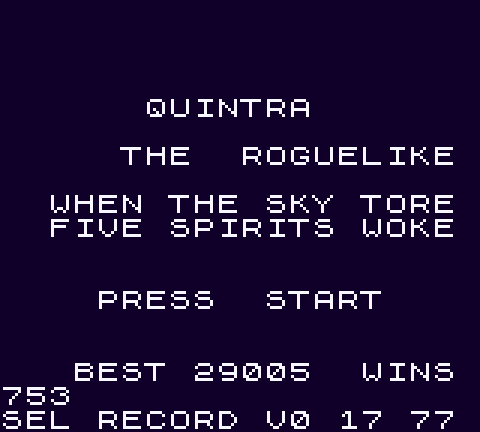
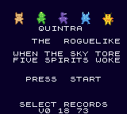
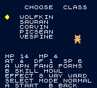
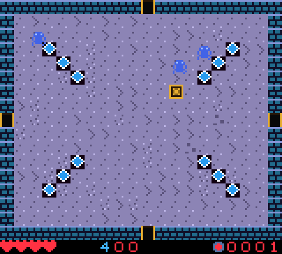
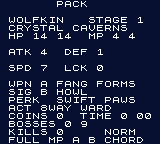
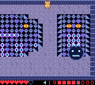
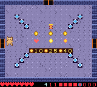
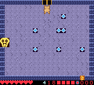
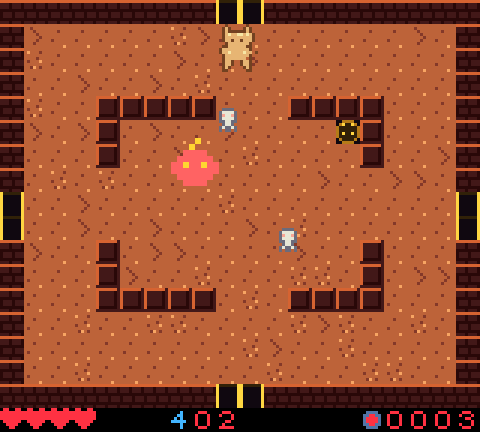

# Quintra

**A procedural Zelda-like action roguelike for the Game Boy Color.**

Native CGB. Five monster-human classes, procgen dungeons every run, bullet-hell
bosses, and item-driven builds. Heavy [Penta Dragon](https://en.wikipedia.org/wiki/Penta_Dragon)
influence (dense projectile patterns) crossed with the maze-exploration feel of
Zelda: Link's Awakening / Final Fantasy Adventure / Ultima: Runes of Virtue.

Written in C with GBDK-2020 — the only thing that ships on cart. All content
authoring and dev tooling is a typed **Rust** workspace that generates the C
tables at build time.

[Download the latest ROM — v0.17.20: Golden Aisle](https://github.com/struktured-labs/quintra/releases/latest)



The v0.17 reel shows the animated five-spirit prologue, champion selection,
live dungeon combat, the Riftwild overworld, a nonlinear cave-to-vault
teleport, and the animated epilogue. The transitions shown are executed by
the cartridge runtime.

## Screens

| Title | Class select | Dungeon | Pack / stats |
|:---:|:---:|:---:|:---:|
|  |  |  |  |

| Stage boss | Merchant | Sanctuary | Ember Depths |
|:---:|:---:|:---:|:---:|
|  |  |  |  |

## Features

- **5 monster-human classes** — Wolfkin, Sauran, Corvin, Picsean, Vespine — each
  with its own stats, primary weapon, signature move, and a live passive perk.
  Conference endurance floors give ranged Corvin six hearts, Picsean five,
  and close-range Vespine four-and-a-half
  while preserving their low-DEF specialist identities; Picsean's Tidal Wave
  raises a brief water barrier while its three bubble lanes erupt, and its
  swim passive crosses Toxic Mire pools without damage.
- **9 distinct dungeon themes**, each with its own palette, numbered music variant, and enemy
  roster: Crystal Caverns → Verdant Hollow → Ember Depths → Frost Vault →
  Toxic Mire → Shadow Keep → Golden Temple → Bloodmoon → Void Sanctum — then
  the ninth colossus, animated ending, and permanent win record. Victors may
  retire to the title or choose an optional max-scaled endless descent.
- **Stage-specific traversal architecture** is content-authored alongside each
  theme: cavern layouts give way to Verdant crystal groves, Ember's broken
  hazard-seam gauntlets, Frost's four-entry crystalline arena rings, and Toxic
  Mire's four ragged poison-pool islands around a safe central cross. Shadow
  Keep then introduces mirrored, offset portcullises that force a three-court
  zig-zag through hard cover; Golden Temple opens into a broad processional
  aisle and transept framed by seeded colonnades and an inner crystal court.
  All exits remain preserved by construction across procedural variants.
- **Skippable cartridge storytelling**: the title animates the seven-beat Old
  Vow of the five champion spirits; victory resolves through three moving
  epilogue tableaux before revealing run statistics. Both keep controls live,
  so repeat runs never wait on a cutscene.
- **9 large-sprite bosses** (32×32 metasprites, distinct runtime silhouettes
  and bullet patterns, with a crowned final Void Lord and telegraphed volleys)
  plus **5 mini-boss types** (each its own sprite,
  colour, and attack), **merchants** with priced wares, and a **sanctuary**
  that fully restores HP/MP before every boss.
- **15 enemies across a size hierarchy** — small swarm critters (crawler,
  hornet, skeleton, wisp), player-sized 16×16 bruisers (orc, warlock),
  exploding **Bombers**, teleporting **Shades**, and **Ropes** (snakes that
  slither then bee-line at you), rotating Sentries, invulnerable-expanding
  **Folding Stars**, Keese-like **Flutterbats**, and life-draining
  **Gloom Leeches**, plus Ember's area-denial **Cinder Maws**. Folding Stars,
  Flutterbats, Gloom Leeches, and Cinder Maws now have dedicated silhouettes
  instead of borrowing older monsters' art, so movement and shape both
  communicate threat.
- **Distinct champion combat + dodge dash**: Wolfkin is a true close-range
  melee fighter; `A` uses each class primary, `B` uses its signature, Sauran
  raises a projectile-breaking cooldown shield, and full-MP `A+B` unleashes
  **Spirit Convergence**. A double-tap **dodge-dash** grants i-frames for
  weaving through bullet hell.
- **RPG layer**: HP/MP/ATK/DEF/SPD/LCK, elemental weakness bonuses, crits,
  hit-flash / hit-stop / knockback / screen shake for weight.
- **Interactive dungeons**: shoot glowing cracked walls for treasure vaults,
  smash **pots** and shatter **crystals** for loot, kick apart rubble, shove
  crates onto rewarding **pressure plates**, and pick your way around **spike
  floors**. Seeded nonlinear **rift wells** disorientingly bounce between
  nonadjacent rooms within the same stage—all across 11 procgen room shapes.
- **Generated world cadence**: three six-room dungeons form a region, followed
  by a safe procedural town with a resident elder, a visually distinct staffed
  market, sanctuary blessing, and seeded merchant stock. A distinct masked
  smith staffs a 30-coin Power Stone forge, while dungeon shops retain their
  own broad-hatted merchant. Cleared dungeons open into an authored 4x4
  nonlinear overworld graph with caves, vaults, champion encounters, and a discoverable
  gate to the next dungeon. Riftwild fights are optional and its exits remain
  fleeable, unlike sealed dungeon arenas. Lore is a
  set of fuzzy generated fixtures—not a fixed campaign replacing the run.
- **Run-long relic builds**: permanent-for-the-run stat items appear in seeded
  vaults and shops. The Vampiric Sigil restores a half-heart every fifth kill;
  an eight-heart cap leaves upgrade room even for six-heart Sauran.
- **Roguelike persistence done right**: battery **suspend save** resumes your
  run (and dies with you — permadeath holds), while best score / runs / wins
  persist forever.
- **Full chiptune audio**: nine numbered exploration variants and nine
  dedicated boss variants, plus title / victory / gameover tracks and 10
  register-level SFX. Reprised melodic families change tempo and pacing, so
  every stage/boss pairing remains audibly distinct within the ROM budget.

## Controls

| Input | Action |
|---|---|
| **D-pad** | Move (8-way aim while firing); double-tap to dodge-dash and shake off attached Gloom Leeches |
| **A** | Primary weapon (Wolfkin: melee) · continue a suspended run (title) |
| **B** | Class signature move (2 MP; Sauran: shield) |
| **A+B** | Spirit Convergence when MP is full |
| **START** | Pack screen (stats, loadout, run clock) |
| **SELECT** | Spirit Compass (dungeon/town progress; Riftwild coordinates, exits, and landmark hint) |

Shoot the glowing amber wall tiles — they hide secret rooms.

## Build & run

Requires [GBDK-2020](https://github.com/gbdk-2020/gbdk-2020) v4.5.0 at `~/gbdk`
and a stable Rust toolchain (host-side only — Rust never ships in the ROM).

```bash
make            # cargo codegen + sprite pipeline → SDCC → rom/working/quintra.gbc
make play       # build + launch in mGBA
make verify     # tests + exact room/boss-state smoke + C<->Rust procgen parity
make preflight  # cart header/checksums + real battery-SRAM power-cycle test
make balance    # five controller-only ROM agents -> tmp/balance-runs.csv
make endurance  # 15 long controller-only runs -> tmp/endurance-runs.csv
make info       # print build summary
```

`make balance` runs the actual cartridge under mGBA with five heuristic
agents, one per champion. They may read combat state to aim, but they only
send controller input—unlike reachability smoke tests, they never refill HP,
delete enemies, or alter progression. Treat their CSV as a repeatable balance
baseline, not a substitute for human playtests. A controller-only Wolfkin
reference run completes all nine bosses and reaches the rendered ending in
36,459 gameplay frames (**10:08** at 60 Hz). Expect roughly **25–45 minutes**
for a first successful human run and **15–25 minutes** once practiced; deaths
and procedural seeds make total session length variable. `make verify` also
boots the ending, checks its battery-SRAM win record, and returns to the title.
Its smoke pass resolves WRAM symbols from the current linker output and asserts
rooms 0→1→2→3→4→6, defeats a live giant through real A-button shots, then
proves Pack-screen entry and room return; it does not trust fixed debug
addresses or screenshot appearance alone.
It enforces a
128 KiB ROM ceiling and at least 512 bytes of free always-mapped bank space;
v0.17.20 occupies 64 KiB with 1,201 bytes of bank-0 headroom.

Before a show build, `make endurance` runs three deterministic long-form seeds
for every champion. It requires at least two complete nine-boss victories and
rendered endings per champion, in addition to complete telemetry. The v0.17.20
baseline records 12/15 full clears—3/3 for Sauran and Picsean, and 2/3 for
Wolfkin, Corvin, and Vespine—with zero combat or route stalls. This deliberately
preserves meaningful seed risk instead of tuning every vessel toward automatic
victory.

The agents use each champion's actual weapon range and B ability, collect
finite hearts/MP/relics after combat, and report combat stalls separately from
route stalls. Narrow a reproduction with `QUINTRA_BALANCE_CLASSES='3 4'` and
`QUINTRA_BALANCE_RUNS='2'`; no health, enemy, RNG, or progression writes are
used in balance runs. Its cleared-room recovery gives tile-path alignment more
time than combat pursuit, preventing collision nudges from defeating its own
shortest-path route. Short-range champions also path around cover to engage,
then line up their final few pixels on the target's cardinal axis before
striking. If cover absorbs four seconds of any weapon's attacks, they flank and
reacquire instead of attacking the wall forever. Debug runs can emit a
one-shot screenshot when a room exceeds the stall threshold by setting
`QUINTRA_BOT_DEBUG_SCREEN=/tmp/quintra-stall`, and the agent
also performs a real double-tap dash when a Gloom Leech attaches. Cleared
dungeon rooms that genuinely exceed that threshold switch to a pixel-exact
feet-box edge follow for one body width, escaping pillar corners that the
coarser tile route cannot represent; overworld routing remains authored.

Cart spec: **64 KiB ROM, MBC5 + 32 KiB RAM + battery, CGB-only**, with the
validated cartridge title `QUINTRA`. `make preflight` checks the Nintendo logo,
mapper/size flags, header and global checksums, then writes a live suspend to
SRAM and resumes it in a fresh emulator instance—the software equivalent of a
power cycle. A GB Operator
can upload the `.gbc` through **Data → Upload Homebrew** to a compatible
rewritable MBC5 flash/reproduction cartridge. It cannot overwrite the mask ROM
inside a normal original retail cartridge. Verify suspend/resume on hardware:
some reproduction boards implement save RAM differently despite accepting the
ROM image. For an EverDrive, skip the Operator and copy `quintra.gbc` directly
to the cartridge's microSD card.

## Architecture

The C runtime under `src/` is the only thing on the cartridge. Content
(classes, items, enemies, biomes, rooms) is hand-authored as **typed Rust** in
`content/`; the `tools/` Rust workspace validates it and emits GBDK-compatible
C tables into `src/generated/` at build time. Invalid content — an orphan item
reference, an oversize table — fails `cargo build`, never the Game Boy.

```
src/       C runtime (core / render / audio / input / game / generated)
content/   typed Rust content (the source of truth)
tools/     Rust workspace — content codegen, asset pipeline, procgen, mGBA bridge
docs/      design specs + media
```

See `docs/superpowers/specs/` for the full engine design and audit.

## Why Rust tooling but a C runtime?

Rust can't target the GBC's Sharp SM83 CPU — no LLVM/GCC backend exists, so the
runtime *must* be C. But Rust shines on the host side: typed content schemas and
compile-time invariant checking mean bad content can't reach the cart.

## Legal

Quintra is wholly original. It contains **no** assets from Penta Dragon or any
other game — only its own art, audio, and code.
